https://d1.awsstatic.com/whitepapers/architecture/AWS-Serverless-Applications-Lens.pdf

_**at 2019-09-15**_

# Serverless Applications Lens

[AWS Well-Architected Framework](https://aws.amazon.com/jp/architecture/well-architected/)

## Notices
This document is provided for informational purposes only. It represents AWS's current product offerings and practices as of the date of issue of this document, which are subject to change without notice. Customers are responsible for making their own independent assessment of the information in this document and any use of AWS's products or services, each of which is provided "as is" without warranty of any kind, whether express or implied. This document does not create any warranties, representations, contractual commitments, conditions or assurances from AWS, its affiliates, suppliers or licensors. The responsibilities and liabilities of AWS to its customers are controlled by AWS agreements, and this document is not part of, nor does it modify, any agreement between AWS and its customers.

## Abstract
This document describes the **Serverless Applications Lens** for the [AWS Well-Architected Framework](https://aws.amazon.com/jp/architecture/well-architected/). The document covers common serverless applications scenarios and identifies key elements to ensure your workloads are architected according to best practices.

## Introduction
The [AWS Well-Architected Framework](https://aws.amazon.com/jp/architecture/well-architected/) helps you understand the pros and cons of decisions you make while building systems on AWS.1 By using the Framework you will learn architectural best practices for designing and operating reliable, secure, efficient, and cost-effective systems in the cloud. It provides a way for you to consistently measure your architectures against best practices and identify areas for improvement. We believe that having well-architected systems greatly increases the likelihood of business success.

In this "Lens" we focus on how to design, deploy, and architect your **serverless application workloads** on the AWS Cloud. For brevity, we have only covered details from the Well-Architected Framework that are specific to serverless workloads. You should still consider best practices and questions that have not been included in this document when designing your architecture. We recommend that you read the [AWS Well-Architected Framework](https://aws.amazon.com/jp/architecture/well-architected/) whitepaper.

This document is intended for those in technology roles, such as chief technology officers (CTOs), architects, developers, and operations team members. After reading this document, you will understand AWS best practices and strategies to use when designing architectures for serverless applications.

## Definitions
The [AWS Well-Architected Framework](https://aws.amazon.com/jp/architecture/well-architected/) is based on five pillars: operational excellence, security, reliability, performance efficiency, and cost optimization. For serverless workloads AWS provides multiple core components (serverless and non-serverless) that allow you to design robust architectures for your serverless applications. In this section, we will present an overview of the services that will be used throughout this document. There are six areas that - you should consider when building a serverless workload:

- Compute layer
- Data layer
- Messaging and streaming layer
- User management and identity layer
- Systems monitoring and deployment
- Edge layer
- Deployment approaches

### Compute Layer

The compute layer of your workload manages requests from external systems, controlling access and ensuring requests are appropriately authorized. It contains the runtime environment that your business logic will be deployed and executed by.

**AWS Lambda** lets you run stateless serverless applications on a managed platform that supports microservices architectures, deployment, and management of execution at the function layer.

With **Amazon API Gateway**, you can run a fully managed REST API that integrates with Lambda to execute your business logic and includes traffic management, authorization and access control, monitoring, and API versioning.

**AWS Step Functions** orchestrates serverless workflows including coordination, state, and function chaining as well as combining long-running executions not supported within Lambda execution limits by breaking into multiple steps or by calling workers running on Amazon Elastic Compute Cloud (Amazon EC2) instances or on-premises.

### Data Layer
The data layer of your workload manages persistent storage from within a system. It provides a secure mechanism to store states that your business logic will need. It provides a mechanism to trigger events in response to data changes.

**Amazon DynamoDB** helps you build serverless applications by providing a managed NoSQL database for persistent storage. Combined with **DynamoDB Streams** you can respond in near real-time to changes in your DynamoDB table by invoking Lambda functions. **DynamoDB Accelerator** (DAX) adds a highly available in-memory cache for DynamoDB that delivers up to 10x performance improvement from milliseconds to microseconds.

With **Amazon Simple Storage Service** (Amazon S3), you can build serverless web applications and websites by providing a highly available key-value store, from which static assets can be served via a Content Delivery Network (CDN), such as Amazon CloudFront.

**Amazon Elasticsearch Service** (Amazon ES) makes it easy to deploy, secure, operate, and scale Elasticsearch for log analytics, full-text search, application monitoring, and more. Amazon ES is a fully managed service that provides both a search engine and analytics tools.

**AWS AppSync** is a managed GraphQL service with enterprise grade security controls, as well as real-time and offline capabilities which make developing applications simple. AWS AppSync provides a data-driven API and a consistent programming language for applications and devices to connect to services such as DynamoDB, Amazon ES, and Amazon S3.

### Messaging and Streaming Layer
The messaging layer of your workload manages communications between components. The streaming layer manages real-time analysis and processing of streaming data.

**Amazon Simple Notification Service** (Amazon SNS) provides a fully managed messaging service for pub/sub patterns using asynchronous event notifications and mobile push notifications for microservices, distributed systems, and serverless applications.

**Amazon Kinesis** makes it easy to collect, process, and analyze real-time streaming data. With **Amazon Kinesis Data Analytics**, you can run standard SQL or build entire streaming applications using SQL.

**Amazon Kinesis Data Firehose** captures, transforms, and loads streaming data into Kinesis Analytics, Amazon S3, Amazon Redshift, and Amazon ES, enabling near real-time analytics with existing business intelligence tools.

### User Management and Identity Layer
The user management and identity layer of your workload provides identity, authentication, and authorization for both external and internal customers of your workload’s interfaces.

With **Amazon Cognito**, you can easily add user sign-up, sign-in, and data synchronization to serverless applications. **Amazon Cognito** user pools provide built-in sign-in screens and federation with Facebook, Google, Amazon, and Security Assertion Markup Language (SAML). **Amazon Cognito** Federated Identities lets you securely provide scoped access to AWS resources that are part of your serverless architecture.

### Systems Monitoring and Deployment
The system monitoring layer of your workload manages system visibility through metrics and creates contextual awareness of how it operates and behaves over time. The deployment layer defines how your workload changes are promoted through a release management process.

With **Amazon CloudWatch**, you can access system metrics on all the AWS services you use, consolidate system and application level logs, and create business key performance indicators (KPIs) as custom metrics for your specific needs. It provides dashboards and alerts that can trigger automated actions on the platform.

**AWS X-Ray** lets you analyze and debug serverless applications by providing distributed tracing and service maps to easily identify performance bottlenecks by visualizing a request end-to-end.

**AWS Serverless Application Model** (AWS SAM) is an extension of AWS CloudFormation that is used to package, test, and deploy serverless applications. SAM CLI can also enable faster debugging cycles when developing Lambda functions locally.

### Deployment approaches
A best practice for deployments in a Microservice architecture is to ensure that a change does not break the service contract of the consumer. If the API owner  makes a breaking change to the service contract and the consumer is not ready for it, failures can occur.

Being aware of which consumers are using your APIs is the first step to ensure deployments are safe. Collecting meta-data on consumers and their usage allows you to make data driven decisions about the impact of changes. API Keys are an effective way to capture meta-data about the API consumer/clients and often used as a form of contact if a breaking change is made to an API.

Some customers who want to take a risk-adverse approach to breaking changes may choose to clone the API and route customers to a different subdomain (e.g. v2.my-service.com) in order to ensure existing consumers aren’t impacted. While this enables new deployments with a new service contract, the tradeoff is that the overhead of maintaining dual APIs (and subsequent backend infrastructure) require additional overhead.

The table shows the different approaches to deployment:

| Deployment | Consumer Impact | Rollback | Event Model Factors | Deployment Speed |
| --- | --- | --- | --- | --- |
| All at once | All at once | Redeploy older version | Any event model at low concurrency rate | Immediate |
| Blue/Green | All at once with some level of production environment testing beforehand | Revert traffic to previous environment (e.g. Blue) | Better for asynchronous and synchronous event models at medium concurrency workloads | Minutes to hours of validation and then immediate to customers |
| Canaries/Linear | 1-10% typical initial traffic shift, then phased increases or all at once | Revert 100% of traffic to previous deployment | Better for high concurrency workloads | Minutes to hours |

#### All-at-once
All at once deployments, as the name implies, involve making all changes at once on top of the existing configuration. An advantage to this style of deployment is that backend changes to data stores, such as a relational database, require a much smaller level of effort to reconcile transactions during  the change cycle. While this type of deployment style is low-effort and can be made with little impact in low-concurrency models, it adds risk when it comes to rollback and usually causes downtime. A good use case for this deployment model is a development environment where the user impact is minimal.

#### Blue-Green
Another traffic shifting pattern is enabling Blue-Green deployments. This near zero-downtime release enables traffic to be shifted to the new live environment (green) while still keeping the existing production environment (blue) active in case a rollback is necessary. API Gateway allows you to define what percentage of traffic is shifted to a particular environment over time, making this style of deployment an effective technique. Because Blue-Green deployments are designed to reduce downtime, many customers adopt this pattern for production changes.

Serverless architectures that follow the best practices of statelessness and idempotency are particularly amenable to this deployment style as they have no affinity to the underlying infrastructure. You should bias these deployments toward smaller incremental changes so that you can easily rollback to a working environment if necessary.

You need the right indicators in place to know if a rollback is required. As a best practice, we recommend using CloudWatch high-resolution metrics, which can monitor in 1 second intervals, and quickly capture downward trend. Used in conjunction with CloudWatch alarms, you can expedite a rollback to occur. CloudWatch metrics can be captured on API Gateway, Step Functions, Lambda (including custom metrics), and DynamoDB.

#### API Gateway Canary Deployments
Canary deployments are an ever-increasing way for you to leverage the new release of software in a controlled environment and enabling rapid deployment cycles. Canary deployments involve deploying a small number of requests to the new change in order to analyze impact to a small number of your users. Since you no longer need to worry about the provisioning and scaling the underlying infrastructure of the new deployment, the AWS Cloud have helped facilitate this adoption.

With Canary deployments in API Gateway, you can deploy a change to your backend endpoint (e.g. Lambda) while still maintaining the same API Gateway 

HTTP endpoint for consumers. In addition, you also can control what percentage of traffic is routed to the new deployment and ensure a controlled traffic cutover. A practical scenario for a canary deployment might be a website redesign: you can monitor the click-through rates on a small number of endusers before shifting all traffic to the new deployment.

#### Lambda Version Control
Like all software, maintaining versioning enables the quick visibility of previously functioning code as well as the ability to revert back to a previous version if a new deployment is unsuccessful. Lambda allows you to publish one or more immutable versions for individual Lambda functions; such that previous versions cannot be changed. Each Lambda function version has a unique Amazon Resource Name (ARN) and new version changes are auditable as they are recorded in CloudTrail. As a best practice in production, customers should enable versioning to best leverage a Reliable Architecture.

To simplify deployment operations and reduce the risk of error, Lambda aliases enable different variations of your Lambda function in your development workflow, such as development, beta, and production. An example of this is when an API Gateway integration with Lambda points to the ARN of a production alias. The production alias will point to a Lambda version. The value of this technique is that enables a safe deployment when promoting a new version to the live environment because the Lambda Alias within the caller configuration remains static thus less changes to make.

### Edge Layer
The edge layer of your workload manages the presentation layer and connectivity to external customers. It provides an efficient delivery method to external customers residing in distinct geographical locations.

**CloudFront** provides a CDN that securely delivers web application content and data with low latency and high transfer speeds.

## General Design Principles
The Well-Architected Framework identifies a set of general design principles to facilitate good design in the cloud for serverless applications:

- **Speedy, simple, singular**: Functions are concise, short, single purpose and their environment may live up to their request lifecycle. Transactions are efficiently cost aware and thus faster executions are preferred.
- **For Scalability, Think concurrent requests**: Serverless applications take advantage of the concurrency model, and tradeoffs at the design level are evaluated based on concurrency.
- **Share nothing**: Function runtime environment and underlying infrastructure are short-lived, therefore local resources such as temporary storage are not guaranteed. State can be manipulated within a state machine execution lifecycle, and persistent storage is preferred for highly durable requirements.
- **Assume no hardware affinity**: Underlying infrastructure may change. Leverage code or dependencies that are hardware-agnostic as CPU flags, for example, may not be available consistently.
- **Orchestrate multiple functions of your application with state machines**: Chaining Lambda executions within the code to orchestrate the workflow of your application results in a monolithic and tightly coupled application. Instead, use a state machine to orchestrate transactions and communication flows.
- **Use events to trigger transactions**: Events such as writing a new Amazon S3 object or an update to a database allow for transaction execution in response to business functionalities. This asynchronous event behavior is often consumer agnostic and drives just-in-time processing to ensure lean service design.
- **Design for failures and duplicates**: Operations triggered from requests/events must be idempotent as failures can occur and a given request/event can be delivered more than once. Include appropriate retries for downstream calls.

## Scenarios
In this section, we cover the five key scenarios that are common in many serverless workloads and how they influence the design and architecture of your serverless workloads on AWS. We will present the assumptions we made for each of these scenarios, the common drivers for the design, and a reference architecture of how these scenarios should be implemented.

### RESTful Microservices

When you’re building a microservice you’re thinking about how a business context can be delivered as a re-usable service for your consumers. The specific implementation will be tailored to individual use cases, but there are several common themes across microservices to ensure that your implementation is secure, resilient, and constructed to give the best experience for your customers.

Building microservices on AWS enables you to take advantage of serverless capabilities, but also to use other AWS services and features, as well as the ecosystem of AWS and AWS Partner Network (APN) Partner tooling. Serverless technologies have built-in fault-tolerance, enabling you to build reliable services for your workloads. The AWS ecosystem enables you to streamline the build, automate tasks, orchestrate dependencies, and monitor and govern your microservices. Lastly, AWS serverless tools are pay-as-you-go, enabling you to grow the service with your business and keep your costs down during entry phases and non-peak times.

Characteristics:

- You want a secure, easy-to-operate framework that is simple to replicate and has high levels of resiliency and availability.
- You want to log utilization and access patterns to continually improve your backend to support customer usage.
- You are seeking to leverage managed services as much as possible for your platforms, which reduces the heavy lifting associated with managing common platforms including security and scalability.

##### Reference Architecture

Figure 1: Reference architecture for RESTful microservices

1. **Customers** leverage your microservices by making API (that is, HTTP) calls. Ideally, your consumers should have a tightly bound service contract to your API in order to achieve consistent expectations of service levels and change control.
2. **Amazon API Gateway** hosts RESTful HTTP requests and responses to customers. In this scenario, API Gateway provides built-in authorization, throttling, security, fault tolerance, request/response mapping, and performance optimizations.
3. **AWS Lambda** contains the business logic to process incoming API calls and leverage DynamoDB as a persistent storage.
4. **Amazon DynamoDB** persistently stores microservices data and scales based on demand. Since microservices are often designed to do one thing really well, a schemaless NoSQL data store is regularly incorporated.

Configuration notes:

- Leverage API Gateway logging to understand visibility of microservices consumer access behaviors. This information is visible in Amazon CloudWatch Logs and can be quickly viewed through Log Pivots or fed into other searchable engines such as Amazon ES or Amazon S3 (with Amazon Athena). The information delivered gives key visibility, such as:
    - Understanding common customer locations, which may change geographically based on the proximity of your backend
    - Understanding how customer input requests may have an impact on how you partition your database
    - Understanding the semantics of abnormal behavior, which can be a security flag
    - Understanding errors, latency, and cache hits/misses to optimize configuration

This model provides a framework that is easy to deploy and maintain and a secure environment that will scale as your needs grow.

### Alexa Skills
The Alexa Skills Kit (ASK) gives developers the ability to extend Alexa's capabilities by building natural, engaging voice and visual experiences. Successful skills are habit-forming—users routinely come back because they not only offer something unique, but also delivers value in new, novel, and frictionless ways.

The biggest cause of frustration from Alexa users is when a skill doesn’t act how they expect and it takes multiple interactions to accomplish what they want. It’s essential to design your voice interaction model first and then working backwards from there, since some users might say too little, too much, or say something that you weren’t expecting. The voice design process involves ideating, scripting, and planning for expected as well as unexpected utterances.

Figure 2: Alexa skill example design script

With a basic script in mind, keep the following techniques in mind as you start building a skill:

- Outline the shortest route to completion
    - The shortest route to completion is generally when the user gives all information and slots at once, an account is already linked if relevant, and other prerequisites are satisfied in a single invocation of the skill.
- Outline alternate paths and decision trees
    - If what the user says doesn’t include all the information necessary to complete the request, identify alternate pathways and user decisions.
- Outline behind-the-scenes decisions the system logic will have to make
    - Identify behind-the-scenes system decisions, for example with new or returning users. A background system check might change the flow a user follows.
- Outline how the skill will help the user
    - Include clear directions in the help for what users can do with the skill. Based on the complexity of the skill, the help topic might provide one simple response or many responses.
- Outline the account linking process, if present
    - Determine the information that is required for account linking. You also need to identify how the skill will respond when account linking hasn’t been completed.

Characteristics:

- You want to create a complete serverless architecture without managing any instance and/or server.
- You want your content to be decoupled from your skill as much as possible.
- You are looking to provide engaging voice experiences exposed as an API to optimize development across wide-ranging Alexa devices, regions, and languages.
- You want elasticity that scales up and down to meet the demands of users and handles unexpected usage patterns.

##### Reference Architecture

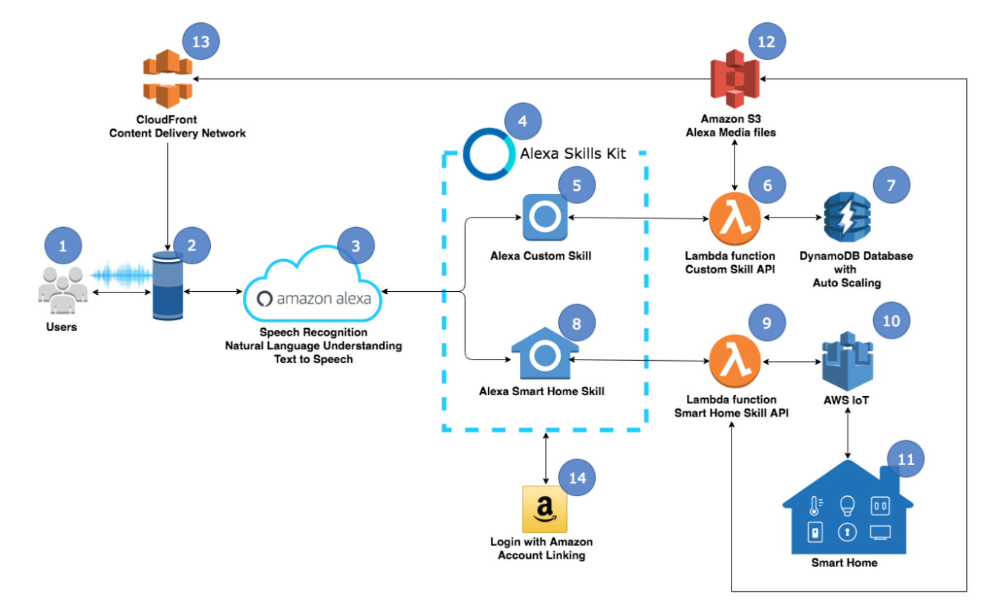
Figure 3: Reference architecture for an Alexa skill

1. **Alexa users** interact with Alexa skills by speaking to Alexa-enabled devices. Voice is the primary method of interaction.
2. **Alexa-enabled devices** listen and activate when requested to do so, such as upon recognizing a wake word.
3. The **Alexa Service** performs common Speech Language Understanding (SLU) processing on behalf of your Alexa skill, including Automated Speech Recognition (ASR), Natural Language Understanding (NLU), and Text to Speech (TTS) conversion.
4. **Alexa Skills Kit** (ASK) is a collection of self-service APIs, tools, documentation, and code samples that makes it fast and easy for you to add skills to Alexa. ASK is a trusted AWS Lambda trigger, allowing for seamless integration.
5. **Alexa Custom Skill** gives you control over the user experience and allows you to build a custom interaction model. It is the most flexible type of skill, but also the most complex.
6. A **Lambda** function using the ASK SDK allows you to seamlessly build skills and avoid unnecessary complexity. You can process different types of requests sent from the Alexa Service and build speech responses.
7. A **DynamoDB database** can provide a NoSQL data store that elastically scales with the usage of your skill. A database is commonly used by skills to for persisting user state and sessions.
8. **Alexa Smart Home Skill** allows you to control devices such as lights, thermostats, smart TV’s, etc., using the Smart Home API. Smart Home skills are simpler to build that custom skills as they don’t give you control over the interaction model.
9. A **Lambda** function is used to respond to device discovery and control requests from the Alexa Service. This allows control of a wide-ranging number of things, including entertainment devices, cameras, lighting, thermostats, locks, and many more.
10. **AWS IoT** allows developers to securely connect their devices to the AWS platform and control interaction between their Alexa skill and their devices.
11. An Alexa enabled **Smart Home** can have many IoT connected devices receiving and responding to directives from an Alexa skill.
12. **Amazon S3** stores you static assets for your skills, such as images, text content, and media. These contents are securely served using CloudFront.
13. **Amazon CloudFront** is a fast Content Delivery Network (CDN) that serves content to geographically-distributed mobile users and includes security mechanisms for static assets in Amazon S3.
14. **Account Linking** is needed when your skill must authenticate with another system. This action associates the Alexa user with a specific user in the other system.

Configuration notes:

- Validate Smart Home request and response payloads by validating against the JSON schema for all possible Alexa Smart Home messages sent by a skill to Alexa.
- Ensure that your Lambda function timeout is set to under 8 seconds and that the function can handle requests within that timeframe. (The Alexa Service timeout is 8 seconds.)
- Lambda functions configured to run within a VPC might experience a startup penalty due to the Elastic Network Interface (ENI) setup. This extra processing time might cause the first request to exceed the 8 second timeout limit of the Alexa service.
- Follow best [practices](https://docs.aws.amazon.com/ja_jp/amazondynamodb/latest/developerguide/best-practices.html) when creating your DynamoDB tables. Calculate your read/write capacity and table partitioning to ensure reasonable response times. For skills that are read-heavy, Amazon DynamoDB Accelerator (DAX) can greatly improve response times.
- Account linking can provide user information that is stored in an external system. Use that information to provide contextual and personalized experience for your user. Alexa has [guidelines on account linking](https://developer.amazon.com/ja/blogs/alexa/post/0fbd9756-6ea0-43d5-b213-873ede1b0595/tips-for-successfully-adding-account-linking-to-your-alexa-skill) to help you provide frictionless experiences.
- Use the skill beta testing tool to collect early feedback during development and for skills versioning to reduce impact on skills already live.
- Use the ASK Command Line Interface (ASK CLI) to automate skill development and deployment.

### Mobile Backend

Users expect their mobile applications to have a fast, consistent, and feature rich user experience. At the same time, mobile user patterns are dynamic with unpredictable peak usage and often have a global footprint.

The growing demand from mobile users means applications need a rich set of mobile services that work together seamlessly without sacrificing control and flexibility of the backend infrastructure. Certain capabilities across mobile applications, are expected by default:

- Ability to query, mutate, and subscribe to database changes
- Offline persistence of data and bandwidth optimizations when connected
- Search, filtering, and discovery of data in applications
- Analytics of user behavior
- Targeted messaging through multiple channels (Push Notifications, SMS, Email)
- Rich content such as images and videos
- Data synchronization across multiple devices and multiple users
- Fine-Grained authorization controls for viewing and manipulating data

Building a serverless mobile backend on AWS enables you to provide these capabilities while automatically managing scalability, elasticity, and availability in an efficient and cost effective way.

Characteristics:

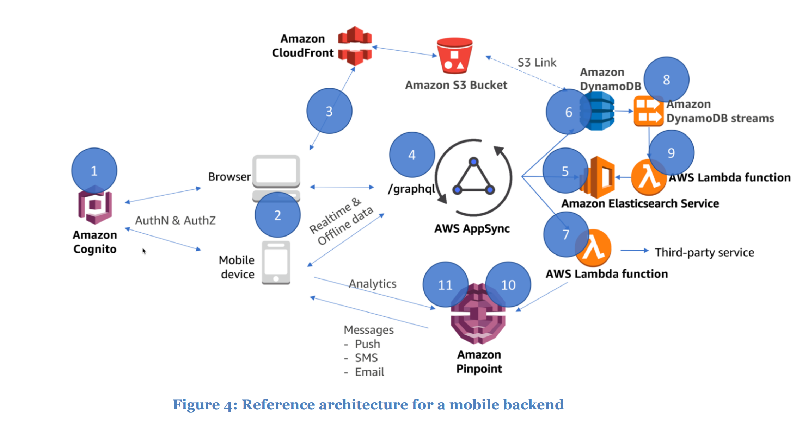
Figure 4: Reference architecture for a mobile backend

- You want to control application data behavior from the client and explicitly select what data you want from the API
- You want your business logic to be decoupled from your mobile application as much as possible.
- You are looking to provide business functionalities as an API to optimize development across multiple platforms.
- You are seeking to leverage managed services to reduce undifferentiated heavy lifting of maintaining mobile backend infrastructure while providing high levels of scalability and availability.
- You want to optimize your mobile backend costs based upon actual user demand versus paying for idle resources

##### Reference Architecture

1. **Amazon Cognito** is used for user management and as an identity provider for your mobile application. Additionally, it allows mobile users to leverage existing social identities such as Facebook, Twitter, Google+, and Amazon to sign in.
2. **Mobile users** interact with the mobile application backend by performing GraphQL operations against AWS AppSync and AWS service APIs (for example, Amazon S3 and Amazon Cognito).
3. **Amazon S3** stores mobile application static assets including certain mobile user data such as profile images. Its contents are securely served via CloudFront.
4. **AWS AppSync** hosts GraphQL HTTP requests and responses to mobile users. In this scenario, data from AWS AppSync is real-time when devices are connected, and data is available offline as well. Data sources can be **Amazon DynamoDB**, **Amazon Elasticsearch Service**, or **AWS Lambda** functions.
5. **Amazon Elasticsearch Service** acts as a main search engine for your mobile application as well as analytics.
6. **DynamoDB** provides persistent storage for your mobile application, including mechanisms to expire unwanted data from inactive mobile users through a Time To Live (TTL) feature.
7. A **Lambda** function handles interaction with other 3rd party services, or calling other AWS services for custom flows, which can be part of the GraphQL response to clients.
8. **DynamoDB Streams** captures item-level changes and enables a Lambda function to update additional data sources.
9. A **Lambda** function manages streaming data between DynamoDB and Amazon ES, allowing customers to combine data sources logical GraphQL types and operations.
10. **Amazon Pinpoint** captures analytics from clients, including user sessions and custom metrics for application insights.
11. **Amazon Pinpoint** delivers messages to all users/devices or a targeted subset based on analytics that have been gathered. Messages can be customized and sent over Push Notifications, Email, or SMS channels.

Configuration notes:

- [Performance test](https://github.com/alexcasalboni/aws-lambda-power-tuning) your Lambda functions with different memory and timeout settings to ensure that you’re using the most appropriate resources for the job.
- Follow [best practices](http://docs.aws.amazon.com/amazondynamodb/latest/developerguide/BestPractices.html) when creating your DynamoDB tables and consider having AWS AppSync automatically provision them from a GraphQL schema, which will use a well-distributed hash key and create indexes for your operations. Make certain to calculate your read/write capacity and table partitioning to ensure reasonable response times.
- Use the AWS AppSync client SDKs to optimize your application experience, as it implements a write-through cache and accounts for lossy network connections where latencies from client-to-cloud can vary.
- Follow [best practices](http://docs.aws.amazon.com/elasticsearch-service/latest/developerguide/es-managedomains.html) when managing Amazon ES Domains. Additionally, Amazon ES provides an extensive [guide](https://www.elastic.co/guide/en/elasticsearch/guide/current/scale.html) on designing with regard to sharding and access patterns that also apply here.
- Reduce unnecessary Lambda function invocations by leveraging caching when possible at the API level.
- Use the Fine-Grained-Access-Controls of AWS AppSync, configured in resolvers, to filter GraphQL requests down to the per-user or group level if necessary. This can be applied to AWS IAM or Cognito User Pools authorization with AWS AppSync.
- Use AWS Amplify and the Amplify CLI to compose and integrate your application with multiple AWS Services. Amplify toolchain also takes care of deploying and managing stacks.

For low-latency requirements where near-to-no business logic is required, Amazon Cognito Federated Identity can provide scoped credentials so that your mobile application can talk directly to an AWS service, for example, when uploading a user’s profile picture, retrieving metadata files from Amazon S3 scoped to a user, etc.

### Stream Processing
Ingesting and processing real-time streaming data requires scalability and low latency to support a variety of applications such as activity tracking, transaction order processing, click-stream analysis, data cleansing, metrics generation, log filtering, indexing, social media analysis, and IoT device data telemetry and metering. These applications are often spiky and process thousands of events per second.

Using AWS Lambda and Amazon Kinesis, you can build a serverless stream process that automatically scales without provisioning or managing servers. Data processed by AWS Lambda can be stored in DynamoDB and analyzed later.

Characteristics:

- You want to create a complete serverless architecture without managing any instance or server for processing streaming data.
- You want to use the Amazon Kinesis Producer Library (KPL) to take care of data ingestion from a data producer-perspective.

##### Reference Architecture

Here we are presenting a scenario for common stream processing, which is a reference architecture for analyzing social media data.

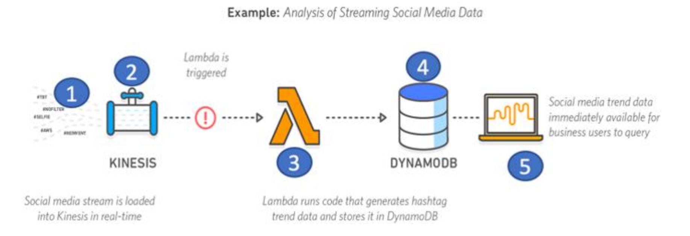
Figure 5: Reference architecture for stream processing

1. **Data producers** use the Amazon Kinesis Producer Library (KPL) to send social media streaming data to a Kinesis stream. Amazon Kinesis Agent and custom data producers that leverage the Kinesis API can also be used.
1. An **Amazon Kinesis stream** collects, processes, and analyzes real-time streaming data produced by data producers. Data ingested into the stream can be processed by a consumer, which, in this case, is Lambda.
1. **AWS Lambda** acts as a consumer of the stream that receives an array of the ingested data as a single event/invocation. Further processing is carried out by the Lambda function. The transformed data is then stored in a persistent storage, which, in this case, is DynamoDB.
1. **Amazon DynamoDB** provides a fast and flexible NoSQL database service including triggers that can integrate with AWS Lambda to make such data available elsewhere.
1. **Business users** leverage a reporting interface on top of DynamoDB to gather insights out of social media trend data.

Configuration notes:

- Follow [best practices](http://docs.aws.amazon.com/streams/latest/dev/kinesis-record-processor-scaling.html) when re-sharding Kinesis streams in order to accommodate a higher ingestion rate. Concurrency for stream processing is dictated by the number of shards. Therefore, adjust it according to your throughput requirements.
- Consider reviewing the [Streaming Data Solutions whitepaper](https://d0.awsstatic.com/whitepapers/whitepaper-streaming-data-solutions-on-aws-with-amazon-kinesis.pdf) for batch processing, analytics on streams, and other useful patterns.
- When not using KPL, make certain to take into account partial failures for non-atomic operations such as PutRecords since the Kinesis API returns both successfully and unsuccessfully processed [records](http://docs.aws.amazon.com/kinesis/latest/APIReference/API_PutRecords.html) upon ingestion time.
- [Duplicated records](http://docs.aws.amazon.com/streams/latest/dev/kinesis-record-processor-duplicates.html) may occur, and you must leverage both retries and idempotency within your application – both consumers and producers.
- Consider using Kinesis Firehose over Lambda when ingested data needs to be continuously loaded into Amazon S3, Amazon Redshift, or Amazon ES.
- Consider using Kinesis Analytics over Lambda when standard SQL could be used to query streaming data, and load only its results into Amazon S3, Amazon Redshift, Amazon ES, or Kinesis Streams.
- Follow best practices for [AWS Lambda stream-based invocation](http://docs.aws.amazon.com/lambda/latest/dg/best-practices.html#stream-events) since that covers the effects on batch size, concurrency per shard, and monitoring stream processing in more detail.

### Web Application
Web applications typically have demanding requirements to ensure a consistent, secure, and reliable user experience. In order to ensure high availability, global availability, and the ability to scale to thousands or potentially millions of users, companies often had to reserve substantial excess capacity to handle web requests at their highest anticipated demand. This often required managing fleets of servers and additional infrastructure components which, in turn, led to significant capital expenditures and long lead times for capacity provisioning.

Using serverless computing on AWS, you can deploy your entire web application stack without performing the undifferentiated heavy lifting of managing servers, guessing at provisioning capacity, or paying for idle resources. Additionally, you do not have to make any compromises on security, reliability, or performance.

Characteristics:

- You want a scalable web application that can go global in minutes with high levels of resiliency and availability.
- You want a consistent user experience with adequate response times.
- You are seeking to leverage managed services as much as possible for your platforms in order to limit the heavy lifting associated with managing common platforms.
- You want to optimize your costs based upon actual user demand versus paying for idle resources.
- You want to create a framework that is easy to set up and operate, and that you can extend with limited impact later.

##### Reference Architecture

Figure 6: Reference architecture for a web application

1. **Consumers** of this web application may be geographically concentrated or worldwide. Leveraging Amazon CloudFront not only provides a better performance experience for these consumers through caching and optimal origin routing, but limits redundant calls to your backend.
1. **Amazon S3** hosts web application static assets and is securely served through CloudFront.
1. An **Amazon Cognito user pool** provides user management and identity provider feature for your web application.
1. As static content served by Amazon S3 is downloaded by the consumer, in many scenarios, dynamic content needs to be sent to or received by your application. For example, when a user submits data through a form, **Amazon API Gateway** serves as the secure endpoint to make these calls and return responses displayed through your web application.
1. An **AWS Lambda** function provides Create, Read, Update, Delete (CRUD) operations on top of DynamoDB for your web application.
1. **Amazon DynamoDB** can provide the backend NoSQL data store to elastically scale with the traffic of your web application.

Configuration Notes:

- Follow best practices for deploying your serverless web application frontend on AWS. More information on that can be found in the operational excellence pillar. Use Amazon S3 for hosting your static web content, and leverage CloudFront to securely deliver your content with low latency and high transfer speeds.
- For single-page web applications, make use of S3 object versioning, CloudFront cache expiration, and fine-tuned content TTL to reflect changes in deployments.
- Refer to the security pillar for recommendations for authentication and authorization.
- Refer to the [RESTful Microservices](#RESTful-Microservices) scenario for recommendations on web application backend.
- For web applications that offer personalized services, you can leverage API Gateway [usage plans](http://docs.aws.amazon.com/apigateway/latest/developerguide/api-gateway-api-usage-plans.html) as well as Amazon Cognito user pools in order to scope what different sets of users have access to. For example, a Premium user can have higher throughput for API calls, access to additional APIs, additional storage, etc.
- Refer to the [Mobile Backend](#Mobile-Backend) scenario if your application uses search capabilities that are not covered in this scenario.

## The Pillars of the Well-Architected Framework
This section describes each of the pillars, and includes definitions, best practices, questions, considerations, and key AWS services that are relevant when architecting solutions for serverless applications.

For brevity, we have only selected the questions from the Well-Architected Framework that are specific to serverless workloads. Questions that have not been included in this document should still be considered when designing your architecture. We recommend that you read the [AWS Well-Architected Framework](https://aws.amazon.com/jp/architecture/well-architected/) whitepaper.

### Operational Excellence Pillar
The **operational excellence** pillar includes the ability to run and monitor systems to deliver business value and to continually improve supporting processes and procedures.

#### Definition
There are three best practice areas for operational excellence in the cloud:

- Prepare
- Operate
- Evolve

In addition to what is covered by the Well-Architected Framework concerning processes, runbooks, and game days, there are specific areas you should look into to drive operational excellence within serverless applications.

#### Best Practices

##### Prepare
There are no operational practices unique to serverless applications that belong to this sub-section. 

##### Operate

> SERVOPS 1: How are you monitoring and responding to anomalies in your serverless application?

Similar to non-serverless applications, anomalies can happen at larger scale in distributed systems. Due to the nature of serverless architectures, it is fundamental to have distributed tracing.

Making changes to your serverless application entails many of the principles of deployment, change, and release management as traditional workloads. However, there are subtle changes in how you use existing tools to accomplish these principles.

Active tracing with AWS X-Ray should be enabled to provide distributed tracing capabilities as well as to enable visual service maps for faster troubleshooting. X-Ray helps you identify performance degradation and quickly understand anomalies including latency distributions.

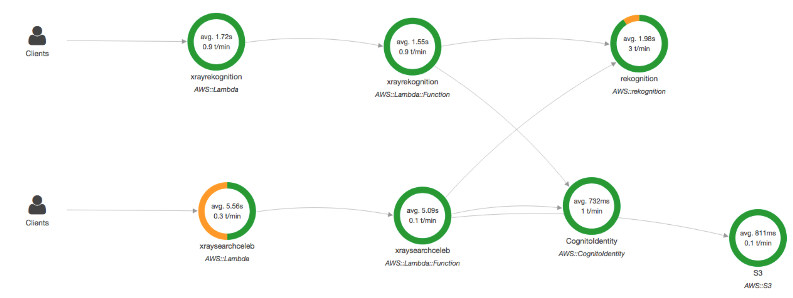
Figure 7: AWS X-Ray Service Map visualizing 2 services

Service Maps are also helpful to understand integration points that need attention and resiliency practices. For integration calls, retries, backoffs and possibly circuit breakers are necessary to avoid faults to propagate to downstream services. Another example is networking anomalies, you should not rely on default timeouts and retry settings but tune them to fail fast should a socket read/write timeout happens where the default can be seconds if not minutes in certain clients.

X-Ray also provides two powerful features that can improve the efficiency on identifying anomalies within applications: Sub-segments and Annotations.

Figure 8: AWS X-Ray Trace with sub-segments beginning with ##

Sub-segments are helpful to understand how operations and logic on a given application breaks down, for example, you can create a sub-segment for the entire Lambda function handler and one for each additional function (sync or async) to understand their overhead in a top-down manner.

Annotations are key-value pairs with string, number, or Boolean values that are automatically indexed by AWS X-Ray. Traces can then be grouped by Annotations and aid on quickly identifying performance stats on application specific operations, for example, how long it takes to query a database, how long it takes to process pictures with large crowds, how many retries it took to succeed or what is the processing time per file/event/operation.

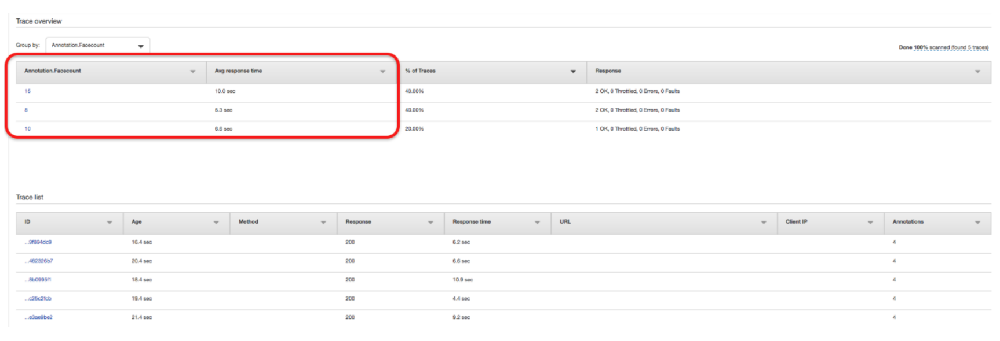
Figure 9: AWS X-Ray Traces grouped by custom annotations

Alarms should be configured at both individual and aggregated levels. Aggregate-level examples include alarming but not limited to the following metrics:

- **Lambda**: Throttling, Errors, ConcurrentExecutions, UnreservedConcurrentExecutions
- **Step Functions**: ActivitiesTimedOut, ActivitiesFailed, ActivitiesHeartbeatTimedOut
- **API Gateway**: 5XXError, 4XXError

An individual-level example is alarming on the Duration metric from Lambda or IntegrationLatency from API Gateway when invoked through API, since different parts of the application likely have different profiles. A bad deployment that makes a function execute for much longer than usual could be quickly captured in this instance.

API Gateway can create detailed metrics per resource/method/stage as well as percentiles such as p99, p50 (median) in order to view detailed and aggregate latency. Likewise, CloudWatch custom metrics that capture business as well as application insights still apply in Serverless architectures.

It is important to understand every Amazon CloudWatch Metrics and Dimensions for every AWS Service you intend to use so that you can put a plan in a place to understand its behavior and add custom metrics where you see fit.
Below are guidelines that can be used whether you are creating a dashboard or looking to formulate a plan for new and existing Applications when it comes to metrics:

- **Business Metrics**
    - Business KPIs that will measure your application performance against business goals and extremely important to know when something is critically affecting your overall business (revenue wise or not).
    - **Examples**: Orders placed, debit/credit card operations, flights purchased, etc.
- **Customer Experience Metrics**
    - Customer Experience data dictates not only the overall effectiveness of its UI/UX but also whether changes or anomalies are affecting customers experience in a particular section of your application. Often times measured in percentiles to prevent outliers when trying to understand the impact over time and how spread it is across your customer base.
    - **Examples**: Perceived latency, time it takes to add an item to a basket/to checkout, page load times, etc.
- **System Metrics**
    - Vendor and Application metrics are important to underpin root causes from the above sections. They also tell you if your systems are healthy, at risk, or already your customers.
    - **Examples**: Percentage of HTTP Errors/Success, Memory utilization, function duration/error/throttling, queue length, stream records length, Integration latency, etc.
- **Operational Metrics**
    - Ops metrics are equally important to understand sustainability and maintenance of a given system and crucial to pinpoint how stability progressed/degraded over time
    - **Examples**: Number of tickets (\[un\]successful resolutions, etc.), number of times people on-call were paged, availability, CI/CD pipeline stats (successful/failed deployments, feedback time, cycle and lead time, etc).

> SERVOPS 2: How are you evolving your serverless application while minimizing the impact of change?

Firstly, favor separate API Gateway endpoints, Lambda functions, Step Functions state machines as well as resources that make up the service for each stage over aliases and versions alone. Leverage Lambda versions and aliases to determine LIVE from $LATEST. For example, a CI/CD pipeline Beta stage can create the following resources in a Beta AWS Account and equally for the respective stages you may want to have in different accounts too (Gamma, Dev, Prod): OrderAPIBeta, OrderServiceBeta, OrderStateMachineWorkflowBeta, OrderBucketBeta, OrderTableBeta.

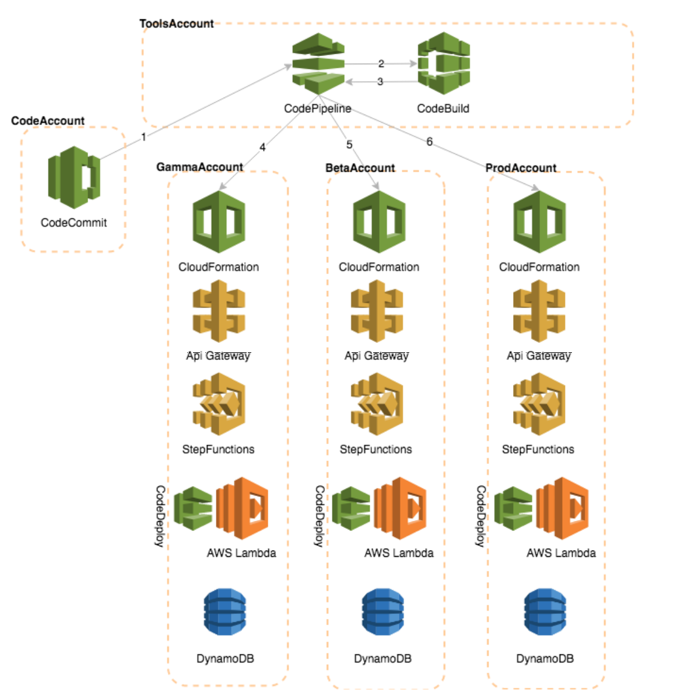
Figure 10: CI/CD Pipeline for multiple accounts

Secondly, favor safer types of deployments over all-at-once deployments for production systems as new changes will gradually shift towards the end user over time be that a Canary or Linear deployment. Use CodeDeploy Hooks (BeforeAllowTraffic, AfterAllowTraffic) and the Alarms feature to gain more control over deployment validation, rollback, and any customization you may need to your application.

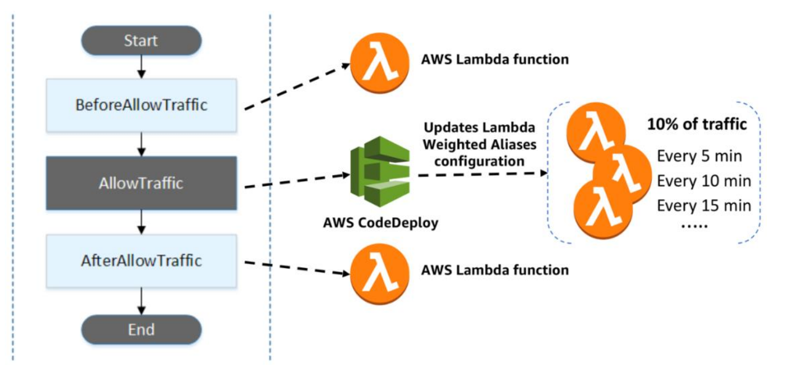
Figure 11: AWS CodeDeploy Lambda deployment and Hooks

Use AWS SAM to package, deploy, and model serverless applications. SAM CLI can also enable faster debugging cycles when developing Lambda functions locally. Additionally, there are a number of third-party serverless frameworks that can be used to package, deploy, and manage serverless solutions on AWS.

Lambda environment variables help separate source code from configuration and this can help you streamline deployments. For example, if a resource called within your Lambda function changes names, only the environment variables value would need to change, not your code.

If you need more fine-grained control over configuration/secrets within serverless applications that you’re sharing across multiple applications/functions, consider the AWS Systems Manager (SSM) Parameter Store feature over environment variables. Parameter Store may incur additional latency, and so you should perform benchmarking when deciding to use SSM Parameter Store or environment variables.

SAM CLI is beneficial for local debugging and simulating events, but performance, integration and regression testing should be carried out in AWS to best reflect how your system works in a production-like environment.

API Gateway stage variables and Lambda aliases/versions should not be used to separate stages as they can add additional operational and tooling complexity including reduced monitoring visibility as a unit of deployment.

To gain the most insight into service metrics, X-Ray should be used in conjunction with CloudWatch metrics. X-Ray gives visibility into data points such as AWS Lambda initialization and throttling across services used, which can be helpful when identifying and responding to anomalies.

##### Evolve
There are no operational practices unique to serverless applications that belong to this sub-section.

#### Key AWS Services
Key AWS services for operational excellence include AWS Systems Manager Parameter Store, SAM, CloudWatch, AWS CodePipeline, AWS X-Ray, Lambda, and API Gateway.

#### Resources
Refer to the following resources to learn more about our best practices for operational excellence.

##### Documentation & Blogs

- [API Gateway stage variables](http://docs.aws.amazon.com/apigateway/latest/developerguide/stage-variables.html)
- [Lambda environment variables](http://docs.aws.amazon.com/lambda/latest/dg/env_variables.html)
- [SAM CLI](https://github.com/awslabs/serverless-application-model)
- [X-Ray latency distribution](https://aws.amazon.com/blogs/aws/latency-distribution-graph-in-aws-x-ray/)
- [Troubleshooting Lambda-based applications with X-Ray](http://docs.aws.amazon.com/lambda/latest/dg/lambda-x-ray.html)
- [System Manager (SSM) Parameter Store](https://docs.aws.amazon.com/systems-manager/latest/userguide/systems-manager-paramstore.html)
- [Continuous Deployment for Serverless applications blog post](https://aws.amazon.com/blogs/compute/continuous-deployment-for-serverless-applications/)
- [SAM Farm: CI/CD example](https://github.com/awslabs/aws-serverless-samfarm)

##### Whitepaper

- [Practicing Continuous Integration/Continuous Delivery on AWS](https://d0.awsstatic.com/whitepapers/DevOps/practicing-continuous-integration-continuous-delivery-on-AWS.pdf)

##### Third-Party Tools

- [Serverless Developer Tools page including third-party frameworks/tools](https://aws.amazon.com/serverless/developer-tools/)
- [Stelligent: CodePipeline Dashboard for operational metrics](https://stelligent.com/2017/11/16/codepipeline-dashboard/)

### Security Pillar
The **security** pillar includes the ability to protect information, systems, and assets while delivering business value through risk assessments and mitigation strategies.

#### Definition
There are five best practice areas for security in the cloud:

- Identity and access management
- Detective controls
- Infrastructure protection
- Data protection
- Incident response

Serverless addresses some of today’s biggest security concerns as it takes infrastructure management tasks away such as operating system patching, binaries, etc. Although the attack surface is reduced compared to non-serverless architectures, OWASP and application security best practices still apply.

The questions in this section are designed to help you address specific ways one attacker could try to gain access to or exploit misconfigured permissions that could lead to abuse. The practices described in this section strongly influence the security of your entire cloud platform and so should not only be validated carefully but also reviewed frequently.

The **incident response** category will not be described in this document because the practices from the [AWS Well-Architected Framework](https://aws.amazon.com/jp/architecture/well-architected/) still apply.

#### Best Practices

##### Identity and Access Management

> SERVSEC 1: How do you authorize and authenticate access to your serverless API?

APIs are often targeted by attackers because of the valuable data they contain and operations that they can perform. There are various security best practices to defend against these attacks. From an authentication/authorization perspective, there are currently three mechanisms to authorize an API call within API Gateway:

- AWS_IAM authorization
- Amazon Cognito user pools
- API Gateway Lambda authorizer
- Resource Policies

Primarily, you want to understand if, and how, any of these mechanisms are implemented. For consumers who currently are located within your AWS environment or have the means to retrieve AWS Identity and Access Management (IAM) temporary credentials to access your environment, you can leverage AWS_IAM authorization and add least-privileged permissions to the respective IAM role in order to securely invoke your API.

Below is a diagram illustrating AWS_IAM authorization in this context:

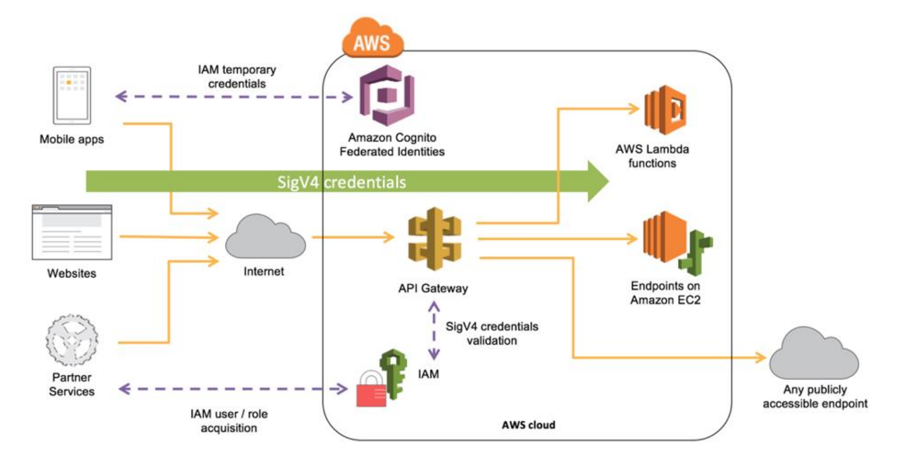
Figure 10: AWS_IAM authorization

For customers who currently have an existing Identity Provider (IdP), you can leverage an API Gateway Lambda authorizer to invoke a Lambda function to authenticate/validate a given user against your IdP. That is also commonly used when you want to perform additional logic on top of an existing IdP. A Lambda authorizer can send additional information derived from bearer token or request context values to your backend service. For example, the authorizer can return a map containing user-ids, user-names, and scope. By using Lambda authorizers, your backend does not require the capability to map authorization tokens to user-centric data, allowing you to limit the exposure of such information to just the authorization function.

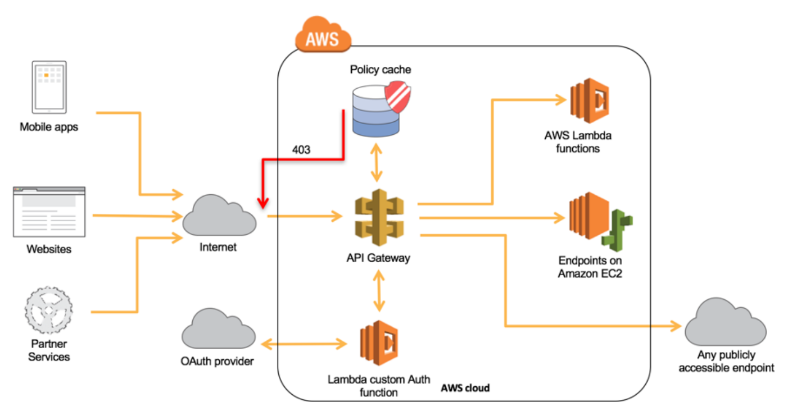
Figure 12: API Gateway Lambda authorizer

For customers who don’t have an IdP, you can leverage Amazon Cognito user pools to either provide built-in user management or integrate with external identity providers such as Facebook, Twitter, Google+, and Amazon.

This is commonly seen in the mobile backend scenario, where users authenticate by using existing accounts in social media platforms while being able to register/sign in with their email address/username. This approach also provides granular authorization through [OAuth Scopes](https://docs.aws.amazon.com/apigateway/latest/developerguide/apigateway-enable-cognito-user-pool.html).

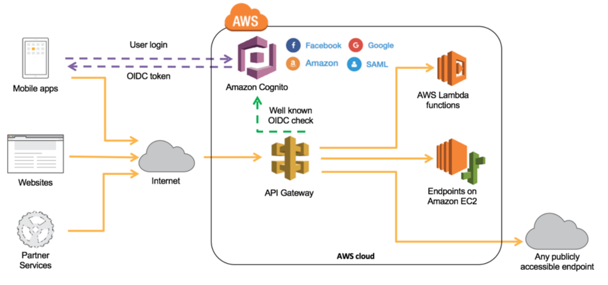
Figure 13: Amazon Cognito user pools

The API Gateway API Keys feature is not a security mechanism and should not be used for authorization. It should be used primarily to track a consumer's usage across your API and could be used in addition to the authorizers previously mentioned in this section.

When using Lambda authorizers, we strictly advise against passing credentials or any sort of sensitive data via query string parameters or headers, otherwise you may open your system up to abuse.

Amazon API Gateway resource policies are JSON policy documents that can be attached to an API to control whether a specified AWS Principal can invoke the API. This mechanism allows you to restrict API invocations by:

- Users from a specified AWS account
- Specified source IP address ranges or CIDR blocks
- Specified virtual private clouds (VPCs) or VPC endpoints (in any account)

Figure 14: Amazon API Gateway Resource Policy based on IP CIDR

With resource policies, you can implement common scenarios such as allowing requests to come only from known clients with a specific IP range or from another AWS Account.

If you plan to restrict access coming from private IP addresses, use the API Gateway private endpoints feature instead. With private endpoints, API Gateway can restrict access to services and resources inside your VPC, or those connected via Direct Connect, to your own data centers.

Combining both private endpoints and resource policies, an API can be limited to specific resource invocations within a specific private IP range. This combination is mostly used on internal microservices where they might be in the same or another account.

When it comes to large deployments and multiple AWS accounts, organizations can leverage API Gateway Authorizers Cross-Account to ease maintenance and centralize security practices. For example, API Gateway has the ability to use Cognito User Pools in a separate account. Lambda Authorizers can also be created and managed in a separate account and then reused across multiple APIs managed by API Gateway. Both scenarios are common for deployments with multiple microservices that are looking to standardize authorization practices across APIs.

Figure 15: API Gateway Cross-Account Authorizers

> SERVSEC 2: How are you enforcing boundaries as to what AWS services your Lambda functions can access?

With regards to what a Lambda function can access, it is recommended to follow least-privileged access and strictly allow only what’s necessary to perform a given operation. Attaching a role with more permissions than necessary can open your systems up for abuse.

Therefore, having smaller functions that perform scoped activities contribute to a more well-architected serverless application within the security context.

With respect to IAM roles, sharing an IAM role within more than one Lambda function will likely violate least-privileged access.

##### Detective Controls

> SERVSEC 3: How are you analyzing serverless application logs?

Log management is an important part of a well-architected design for reasons ranging from security/forensics to regulatory or legal requirements.

It is equally important that you track vulnerabilities in application dependencies because attackers can exploit known vulnerabilities found in dependencies regardless of which programming language is used.

Leverage CloudWatch Logs metric filters to transform your serverless application standard output into custom metrics through regex pattern matching. In addition, create CloudWatch alarms based on your application custom metrics to quickly gain insight into how your application is behaving.

Similarly, AWS CloudTrail logs should also be used both for auditing and for API calls.

Consider enabling [API Gateway Access Logs](https://docs.aws.amazon.com/apigateway/latest/developerguide/set-up-logging.html) and selectively choose only the data you need. Depending on your design, your serverless application might contain sensitive data. For this reason, we recommend that you encrypt any sensitive data traversing your serverless application. For more information, see the [Data Protection](#Data-Protection) section.

Lambda functions are designed to do one task and complete it as fast as possible. Therefore, making API calls to CloudWatch within your code may cause the observer effect and excessive printing statements may ingest unnecessary data into your logs. This will cause both an increase in signal-to-noise ratio as well as CloudWatch Logs ingestion charges.

> SERVSEC 4: How do you monitor dependency vulnerabilities within your serverless application?

With regard to application dependency vulnerability scans, there are a number of both commercial and open-source solutions, such as OWASP Dependency Check that can integrate within your CI/CD pipeline. It is important to include all your dependencies, including AWS SDKs, as part of your version control software repository.

##### Infrastructure Protection
Although there is no infrastructure to manage in serverless applications, there could be scenarios where your serverless application needs to interact with other components deployed in a virtual private cloud (VPC) or applications residing on-premises. Consequently, it is important to ensure networking boundaries are considered under this assumption.

> SERVSEC 5: For VPC access, how are you enforcing networking boundaries as to what AWS Lambda functions can access?

Lambda functions can be configured to access resources within a VPC including resources sitting outside of AWS through VPN connections. You should review security group best practices as covered in the [AWS Well-Architected Framework](https://aws.amazon.com/jp/architecture/well-architected/).

Also, similar to a non-serverless application, a security group and Network Access Control Lists (NACLs) should be the basis on which networking boundaries are enforced. For workloads that require outbound traffic filtering due to compliance reasons, proxies can be used in the exact same manner that they are placed in non-serverless architectures.

Enforcing networking boundaries solely at code level given instructions as to what resource one could access is not recommended due to separation of concerns.

##### Data Protection

> SERVSEC 6: How are you protecting sensitive data within your serverless application?

API Gateway employs the use of TLS across all communications, client and integrations. Although HTTP payloads are encrypted in-transit, request path and query strings that are part of a URL might not be. Also, encrypted HTTP payloads may be unencrypted when received from API Gateway, AWS Lambda in this case. Therefore sensitive data can be accidentally exposed via CloudWatch Logs if sent to standard output.

Additionally, malformed or intercepted input can be used as an attack vector to either gain access to a system or cause it to malfunction.

Sensitive data should be protected at all times in all layers possible as discussed in detail in the [AWS Well-Architected Framework](https://aws.amazon.com/jp/architecture/well-architected/). The recommendations in that whitepaper still apply here.

With regard to API Gateway, sensitive data should be either encrypted at the client-side before making its way as part of an HTTP request or sent as a payload as part of an HTTP POST request. That also includes encrypting any headers that might contain sensitive data prior to making a given request.

Concerning Lambda functions or any integrations that API Gateway may be configured with, sensitive data should be encrypted prior to any processing or data manipulation. This will prevent data leakage in the event that such data gets exposed in a persistent storage chosen or via standard output that is streamed and persisted by CloudWatch Logs. In the scenarios described earlier in this document, Lambda functions would persist encrypted data in either DynamoDB, Amazon ES, or Amazon S3 along with encryption at rest.

We strictly advise against sending, logging, and storing unencrypted sensitive data, be it part of an HTTP request path/query strings or standard output of a Lambda function.

Enabling logging in API Gateway where sensitive data is unencrypted is also discouraged. As mentioned in the [Detective Controls](#Detective-Controls) sub-section, you should consult about such an operation with your compliance team before enabling API Gateway logging.

> SERVSEC 7: What is your strategy on input validation?

For input validation, make sure to set up API Gateway basic request validation as a first step to ensure that the request adheres to the configured JSON Schema request model as well as any required parameter in the URI, query string, or headers. Application-specific deep validation should be implemented, whether that is as a separate Lambda function, library, framework, or service.

#### Key AWS Services
Key AWS services for security are Amazon Cognito, IAM, Lambda, CloudWatch Logs, AWS CloudTrail, AWS CodePipeline, Amazon S3, Amazon ES, DynamoDB, and Amazon Virtual Private Cloud (Amazon VPC.)

#### Resources
Refer to the following resources to learn more about our best practices for security.

##### Documentation & Blogs

- [IAM role for Lambda function with Amazon S3 example](http://docs.aws.amazon.com/lambda/latest/dg/with-s3-example-create-iam-role.html)
- [API Gateway Request Validation](http://docs.aws.amazon.com/apigateway/latest/developerguide/api-gateway-method-request-validation.html)
- [API Gateway Lambda Authorizers](http://docs.aws.amazon.com/apigateway/latest/developerguide/use-custom-authorizer.html)
- [Securing API Access with Amazon Cognito Federated Identities, Amazon Cognito User Pools, and Amazon API Gateway](https://aws.amazon.com/blogs/compute/secure-api-access-with-amazon-cognito-federated-identities-amazon-cognito-user-pools-and-amazon-api-gateway/)

- [Configuring VPC Access for AWS Lambda](http://docs.aws.amazon.com/lambda/latest/dg/vpc.html)
- [Filtering VPC outbound traffic with Squid Proxies](https://aws.amazon.com/pt/articles/using-squid-proxy-instances-for-web-service-access-in-amazon-vpc-another-example-with-aws-codedeploy-and-amazon-cloudwatch/)

##### Whitepapers

- [OWASP Secure Coding Best Practices](https://www.owasp.org/images/0/08/OWASP_SCP_Quick_Reference_Guide_v2.pdf)
- [AWS Security Best Practices](https://d0.awsstatic.com/whitepapers/Security/AWS_Security_Best_Practices.pdf)

##### Partner Solutions

- [PureSec Serverless Security](https://puresec.io/)
- [Twistlock Serverless Security](https://www.twistlock.com/products/serverless-security/)
- [Protego Serverless Security](https://www.protego.io/)
- [Snyk – Commercial Vulnerability DB and Dependency Check](https://snyk.io/)

##### Third-Party Tools

- [OWASP Vulnerability Dependency Check](https://www.owasp.org/index.php/OWASP_Dependency_Check)

### Reliability Pillar
The reliability pillar includes the ability of a system to recover from infrastructure or service disruptions, dynamically acquire computing resources to meet demand, and mitigate disruptions such as misconfigurations or transient network issues.

#### Definition
There are three best practice areas for reliability in the cloud:

- Foundations
- Change management
- Failure management

To achieve reliability, a system must have a well-planned foundation and monitoring in place, with mechanisms for handling changes in demand, requirements, or potentially defending an un-authorized denial of service attack. The system should be designed to detect failure and, ideally, automatically heal itself.

#### Best Practices

##### Foundations

> SERVREL 1: Have you considered serverless limits for peak workloads?

AWS enforces default service limits to protect customers for unauthorized use of services. Limits that are not properly monitored may result in a degradation or throttling of service. Many limits are soft limits and can be raised if you anticipate exceeding them.

You can use AWS Trusted Advisor within the AWS Management Console and APIs to detect whether a service exceeds 80% of a [limit](https://aws.amazon.com/answers/account-management/limit-monitor/).

You can also proactively raise limits if you anticipate exceeding them for workloads. When raising these limits, ensure there is a sufficient gap between your service limit and your max usage to accommodate scale or absorb a denial of service attack. You should consider these limits across all relevant accounts and Regions.

Regardless of whether your serverless application is spiky or not, following asynchronous patterns when designing communications between services and transactions makes for a more resilient serverless application.

> SERVREL 2: How are you regulating access rates to and within your serverless application?

###### Throttling
In a microservices architecture, API consumers may be in separate teams or even outside the organization. This creates a vulnerability due to unknown access patterns as well as the risk of consumer credentials being compromised. The service API can potentially be affected if the number of requests exceeds what the processing logic/backend can handle.

Additionally, events that trigger new transactions such as an update in a database row or new objects being added to an S3 bucket as part of the API, will trigger additional executions throughout a serverless application.

Throttling should be enabled at the API level to enforce access patterns established by a service contract. Defining a request access pattern strategy is fundamental to establish how a consumer should use a service be that at the resource level or global level.

Returning the appropriate HTTP status codes within your API (such as a 429 for throttling) helps consumers plan for throttled access by implementing back-off and retries accordingly.

For more granular throttling and metering usage, issuing API keys to consumers with usage plans in addition to global throttling enables API Gateway to enforce access patterns in unexpected behavior. API keys also simplifies the process for administrators to cut off access if an individual consumer is making suspicious requests.

A common way to capture API keys is through a developer portal. This provides you, as the service provider, with additional metadata associated with the consumers and requests. You may capture the application, contact information, and business area/purpose and store this in a durable data store like DynamoDB. This gives you additional validation of your consumers and traceability of logging with identities, and can contact consumers for breaking change upgrades/issues.

As discussed in the security pillar, API keys are not a security mechanism to authorize requests, and, therefore, should only be used with one of the available authorization options available within API Gateway.

Concurrency controls are sometimes necessary to protect specific workloads against service failure as they may not scale as rapidly as Lambda. [Concurrency controls](https://docs.aws.amazon.com/lambda/latest/dg/concurrent-executions.html) enable you to control the allocation of how many concurrent invocations of a particular Lambda function and are set at the individual Lambda function level. Lambda invocations that exceed concurrency set to an individual function will be throttled by the AWS Lambda Service and the result will vary depending on their event source – Synchronous invocations return HTTP 429 error, Asynchronous invocations will be queued and retried while Stream-based event sources will retry up to their record expiration time.

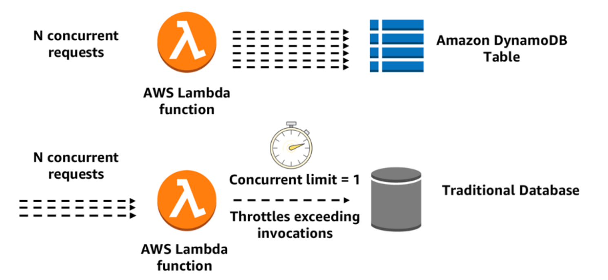
Figure 16: AWS Lambda concurrency controls

Controlling concurrency is particularly useful for the following scenarios:

- Sensitive backend or integrated systems that may have scaling limitations
- Database Connection Pool restrictions such as a relational database, which may impose concurrent limits
- Critical Path Services: Higher priority Lambda functions, such as authorization vs lower priority functions (e.g. back-office) against limits in the same account
- Ability to disable Lambda function (concurrency = 0) in the event of anomalies.
- Limiting desired execution concurrency to protect against Distributed Denial of Service (DDoS) attacks

> SERVREL 3: What is your strategy on asynchronous calls and events within your serverless architecture?

###### Asynchronous Calls and Events
Asynchronous calls reduce the latency on HTTP responses. Multiple synchronous calls, as well as long-running wait cycles, may result in timeouts and “locked” code that prevents retry logic. Event-driven architectures enable streamlining asynchronous executions of code, thus limiting consumer wait cycles.

Event-driven architectures that are commonly implemented within serverless applications are asynchronous. State machines, queues, pub/sub, WebHooks, events, and other techniques are commonly applied across multiple components that perform a business functionality.

User experience is decoupled with asynchronous calls. Instead of blocking the entire experience until the overall execution is completed, frontend systems receive a reference/job ID as part of their initial request and an additional API is used to poll its status. This decoupling allows the frontend to be more efficient by using event loops, parallel, or concurrency techniques while making such requests and lazily loading parts of the application when a response is partially or completely available.

Also, frontend becomes a key element in asynchronous calls as it becomes more robust with custom retries and caching. It can halt an in-flight request if no response has been received within an acceptable SLA, be it caused by an anomaly, transient condition, networking, or degraded environments.

Alternatively, when synchronous calls are necessary, it is recommended at minimum to ensure the entire execution doesn’t exceed API Gateway max timeout and that coordination is done by an external service (for example, AWS Step Functions) to control both state and exceptions that can occur along the request lifecycle.

> SERVREL 4: What’s your testing strategy for serverless applications?

###### Testing
Testing is commonly done through unit, integration, and acceptance tests. Developing robust testing strategies can emulate your serverless application under different loads and conditions.

Unit tests shouldn’t be different from non-serverless applications and, therefore, can run locally without any required changes.

Integration tests shouldn’t mock services you can’t control, since they may change and may provide unexpected results. These tests are better performed when using real services because they can provide the exact same environment a serverless application would use when processing requests in production.

Acceptance or end-to-end tests should be performed without any changes because the primary goal is to simulate end users’ actions through the external interface available to them. Therefore, there is no unique recommendation to be aware of here.

In general, Lambda and third-party tools that are available in the AWS Marketplace can be used as a test harness in the context of performance testing.

Here are some considerations during performance testing to be aware of:

- Metrics such as invoked max memory are available in CloudWatch Logs. The metrics may indicate optimal memory and proper timeout value. For more information, read the performance pillar section.
- If your Lambda function runs inside a VPC, pay attention to available IP address space inside your subnet. For more information, read the operational excellence pillar section.
- Creating modularized code into separate functions outside of the handler enables more unit-testable functions.
- Establishing externalized connection code (such as a connection pool to a relational database) referenced in the Lambda function’s static constructor/initialization code (that is, global scope, outside the handler) will ensure that external connection thresholds aren’t reached if the Lambda execution environment is reused.
- Adjust the throughput of the DynamoDB read and write tables accordingly, and make sure to set up Auto Scaling to accommodate throughput changes throughout the performance testing cycle.
- Take into account any other service limits not listed here that may be used within your serverless application under performance testing.

> SERVREL 5: How are you building resiliency into your serverless application?

##### Change Management
Having the ability to revert back to a previous version in the event of a failed change ensures service availability.

First, you need to put monitoring metrics in place. Determine what your environment workload’s “normal” state is and define the appropriate metrics and threshold parameters in CloudWatch to determine what is "not normal" based on historical data.

Also monitor deployments and implement automated actions. Features such as SAM Safe Deployments can provide you better control as to how changes impact your environment and Cloudwatch Alarms should be used to rollback to a previous deployment should any of them breach

##### Failure Management
Certain parts of a serverless application are dictated by asynchronous calls to various components in an event-driven fashion, via pub/sub and other patterns. When asynchronous calls fail they should be captured and retried whenever possible, or else data loss can occur. In addition, the result can be a degraded customer experience.

For Lambda functions, build retry logic into your Lambda queries to ensure that spiky workloads don’t overwhelm your backend. Also, leverage the Lambda logging library within function code to add errors to CloudWatch Logs, which can be captured as a custom metric. For more information, read the operational excellence pillar section.

AWS SDKs provide back-off and retry mechanisms by default when talking to other AWS services that are sufficient in most cases. However, they should be reviewed and possibly tuned in order to suit your needs.

AWS X-Ray and third-party Application Performance Monitoring (APM) solutions can help enable distributed tracing to identify throttling, and how distribution latency is affected when they occur.

For asynchronous calls that may fail, it is a best practice to enable Dead Letter Queues (DLQ) and create dedicated DLQ resources (using Amazon SNS and Amazon Simple Queue Service (Amazon SQS)) for individual Lambda functions. You also want to develop a plan to poll by a separate mechanism to re-drive these failed events back to their intended service.

Whenever possible, Step Functions should be used to minimize the amount of custom try/catch, back-off, and retries within your serverless applications. For more information, read the cost optimization pillar section.

Moreover, non-atomic operations such as PutRecords (Kinesis) and BatchWriteItem (DynamoDB) can return successful in the event of a partial failure. Therefore, the response should be inspected at all times when using such operations and programmatically dealt with.

For synchronous parts that are transaction-based and depend on certain guarantees and requirements, rolling back failed transactions as described by the [Saga pattern](http://theburningmonk.com/2017/07/applying-the-saga-pattern-with-aws-lambda-and-step-functions/) can also be achieved by using Step Functions state machines, which will decouple and simplify the logic of your application.

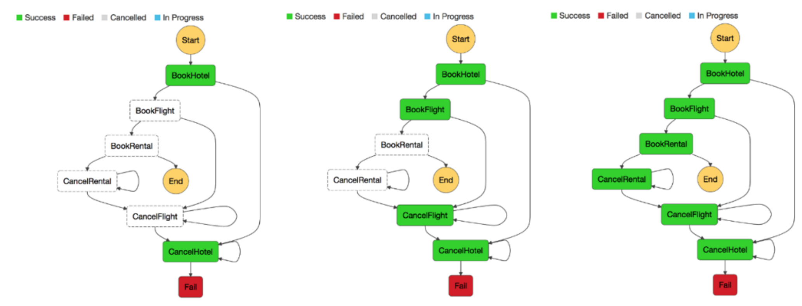
Figure 17: Saga pattern in Step Functions by Yan Cui

#### Key AWS Services
Key AWS services for reliability are AWS Marketplace, Trusted Advisor, CloudWatch Logs, CloudWatch, API Gateway, Lambda, X-ray, Step Functions, Amazon SQS, and Amazon SNS.

#### Resources
Refer to the following resources to learn more about our best practices for security.

##### Documentation & Blogs
- [Limits in Lambda](http://docs.aws.amazon.com/lambda/latest/dg/limits.html)
- [Limits in API Gateway](http://docs.aws.amazon.com/apigateway/latest/developerguide/limits.html#api-gateway-limits)
- [Limits in Kinesis Strea](http://docs.aws.amazon.com/streams/latest/dev/service-sizes-and-limits.html)
- [Limits in DynamoDB](http://docs.aws.amazon.com/amazondynamodb/latest/developerguide/Limits.html)
- [Limits in Step Functions](http://docs.aws.amazon.com/step-functions/latest/dg/limits.html)
- [Error handling patterns](https://aws.amazon.com/blogs/compute/error-handling-patterns-in-amazon-api-gateway-and-aws-lambda/)
- [Serverless testing with Lambda](https://aws.amazon.com/blogs/compute/serverless-testing-with-aws-lambda/)
- [Monitoring Lambda Functions Logs](http://docs.aws.amazon.com/lambda/latest/dg/monitoring-functions-logs.html)
- [Versioning Lambda](http://docs.aws.amazon.com/lambda/latest/dg/versioning-aliases.html)
- [Stages in API Gateway](http://docs.aws.amazon.com/apigateway/latest/developerguide/stages.html)
- [API Retries in AWS](http://docs.aws.amazon.com/general/latest/gr/api-retries.html)
- [Step Functions error handling](http://docs.aws.amazon.com/step-functions/latest/dg/tutorial-handling-error-conditions.html#using-state-machine-error-conditions-step-4)
- [X-Ray](http://docs.aws.amazon.com/xray/latest/devguide/xray-services-lambda.html)
- [Lambda DLQ](http://docs.aws.amazon.com/lambda/latest/dg/dlq.html)
- [Error handling patterns with API Gateway and Lambda](https://aws.amazon.com/blogs/compute/error-handling-patterns-in-amazon-api-gateway-and-aws-lambda/)
- [Step Functions Wait state](http://docs.aws.amazon.com/step-functions/latest/dg/amazon-states-language-wait-state.html)
- [Saga pattern](http://microservices.io/patterns/data/saga.html)
- [Applying Saga pattern via Step Functions](http://theburningmonk.com/2017/07/applying-the-saga-pattern-with-aws-lambda-and-step-functions/)

#### Whitepapers

- [Microservices on AWS](https://d0.awsstatic.com/whitepapers/microservices-on-aws.pdf)

### Performance Efficiency Pillar
The **performance efficiency** pillar focuses on the efficient use of computing resources to meet requirements and the maintenance of that efficiency as demand changes and technologies evolve.

#### Definition
Performance efficiency in the cloud is composed of four areas:

- Selection
- Review
- Monitoring
- Tradeoffs

Take a data-driven approach to selecting a high-performance architecture. Gather data on all aspects of the architecture, from the high-level design to the selection and configuration of resource types. By reviewing your choices on a cyclical basis, you will ensure that you are taking advantage of the continually evolving AWS Cloud. Monitoring will ensure that you are aware of any deviance from expected performance and can take action on it. Finally, you can make tradeoffs in your architecture to improve performance, such as using compression or caching, or relaxing consistency requirements.

#### Selection
In the AWS Lambda resource model, you choose the amount of memory you want for your function and are allocated proportional CPU power and other resources such as networking and storage IOPS. For example, choosing 256 MB of memory allocates approximately twice as much CPU power to your Lambda function as requesting 128 MB of memory and half as much CPU power as choosing 512 MB of memory.

In the Kinesis resource model, you choose how many shards you may need based on ingestion and consumption rate (reads, writes, data size). In the DynamoDB resource model, you choose how many reads and writes per second you may need based on your requirements.

Make sure to run performance testing on your Lambda functions prior to deciding on memory and timeout settings for your serverless application. Fine tuning memory and timeout will have a significant impact on performance, cost, and operational procedures.

It is recommended to set function timeout a few seconds higher than the average execution to account for any transient issues in downstream services used in the communication path. This also applies when working with Step Functions activities and tasks.

Along with performance testing and data requirements, Kinesis and DynamoDB capacity units will be more closely aligned with your workload profile.

> SERVPER 1: How do you choose the most optimum capacity units (memory, shards, reads/writes per second) within your serverless application?

Choosing a default memory setting and timeout in AWS Lambda may have an undesired effect in performance, cost, and operational procedures.

Setting the timeout much higher than the average execution may cause functions to execute for longer upon code malfunction, resulting in higher costs and possibly reaching concurrency limits depending on how such functions are invoked.

Setting timeout that equals one successful function execution may trigger a serverless application to abruptly halt an execution should any transient networking issue or abnormality in downstream services occur.

Setting timeout without performing load testing and, more importantly, without considering upstream services may result in errors whenever any part reaches its timeout first.

> SERVPER 2: How have you optimized the performance of your serverless application?

##### Optimize
As a serverless architecture grows organically, there are certain mechanisms that are commonly used across a variety of workload profiles. Despite performance testing, design tradeoffs should be considered in order to increase your application’s performance, always keeping your SLA and requirements in mind.

API Gateway caching can be enabled in order to improve performance for applicable operations. Similarly, DAX can improve read responses significantly as well as Global and Local Secondary Indexes to prevent DynamoDB full scan operations. These details and resources were described in the Mobile Backend scenario.

In addition to API Gateway caching, content encoding allows API clients to request the payload to be compressed before being sent back in the response to an API request. This reduces the number of Bytes that is sent from API Gateway to API clients and decreases the time it takes to transfer the data. You can enable content encoding in the API definition and you can also set the minimum response size that triggers compression. By default, APIs do not have content encoding support enabled.

Also described in Mobile Backend scenario, it is recommended to test the performance of your Lambda functions by using accurately sized sample workflows and varying the memory settings and timeout values.

Leverage global scope within your Lambda function code to take advantage of Lambda container reuse. With that, database connection and AWS services initial connection and configuration will be executed once if the environment in which that Lambda function was executed is still available.

##### Deployment
Lambda functions don’t always need to be deployed in a VPC. Similarly, CPU and network bandwidth are proportionally allocated based on memory settings configured for a Lambda function.

Configure VPC access to your Lambda functions only when necessary, as deploying your function in a VPC will result in additional startup time for your Lambda function since Elastic Network Interfaces (ENI) must be created beforehand.

If your Lambda function needs access to the VPC and to the internet, you’ll need a NAT gateway in order to allow traffic from Lambda to any resource available publicly on the internet. We recommend that you place a NAT gateway across multiple Availability Zones for high availability and performance.

As regards to API Gateway, you can choose from two types of API endpoints when creating REST APIs and custom domains with API Gateway – Edge optimized and Regional Endpoint APIs: 

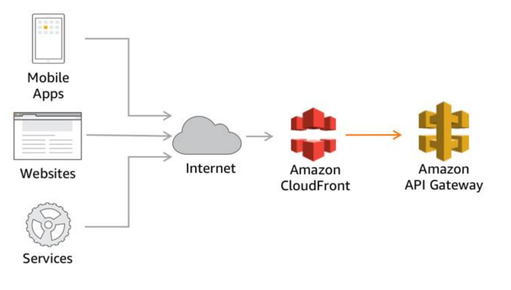
Figure 18: Edge-optimized API Gateway deployment

Edge-optimized APIs are endpoints that are accessed through a CloudFront distribution that is created and managed by API Gateway. API requests are routed to the nearest CloudFront Point of Presence (POP) which typically improves connection time for geographically diverse clients. An API is edge - optimized if you do not explicitly specify its endpoint type when creating the API.

Figure 19: Regional Endpoint API Gateway deployment

Regional API is the system-default option for creating APIs with API Gateway. A Regional API endpoint is accessed from the same AWS region in which your REST API is deployed. This helps you reduce request latency when API requests originate from the same region as your REST API. Additionally, you can choose to associate your own Amazon CloudFront distribution with the regional API  endpoint. For in-region requests, a regional endpoint bypasses the unnecessary round trip to a CloudFront distribution.

The table below can help you decide whether to deploy and Edge-optimized API or Regional API Endpoint:

|| Edge-optimized API | Regional API Endpoint |
| --- | --- | --- |
| API is accessed across regions. Includes API Gateway managed CloudFront distribution | X ||
| API is accessed within same region. Least request latency when API is accessed from same region as API is deployed || X |
| Ability to associate own CloudFront distribution || X |

> SERVPER 3: How do you decide what components of your serverless application should be deployed in a VPC?

The decision tree below can help you decide whether to deploy your Lambda function in a VPC.

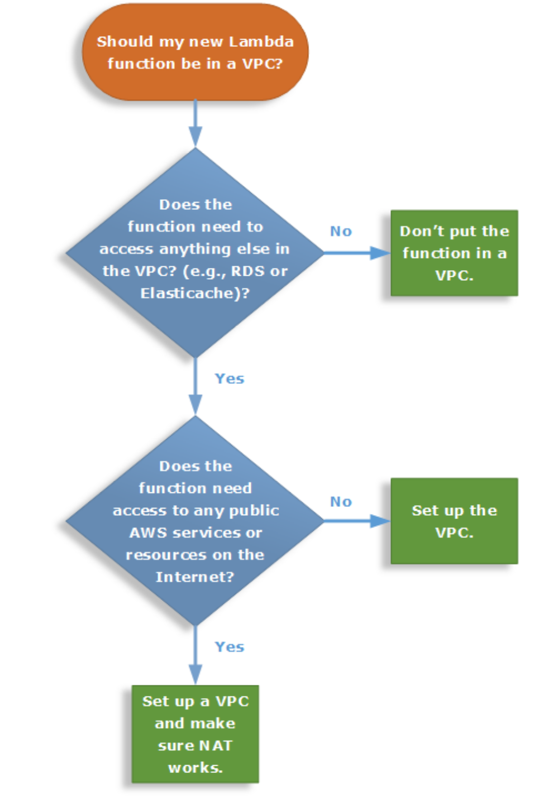
Figure 20: Decision tree for deploying a Lambda function in a VPC

> SERVPER 4: How are you optimizing your Lambda code for performance?

##### Code Optimization
Lambda functions are single purpose and execute as fast as possible. However, there are techniques that can be leveraged to take advantage of the execution environment, as well as general design principles, since existing application dependencies/frameworks in non-serverless applications may not always be the best choice in this context.

On AWS, follow best practices for working with Lambda functions55 such as container re-use, minimizing deployment package size to its runtime necessities, and minimizing the complexity of your dependencies. Tradeoff here is key when making this decision. 99th percentile (P99) should be always taken into account, as one may not impact application SLA agreed with other teams.

For Lambda functions in VPC, avoid DNS resolution of public host names for your VPC. This may take several seconds to resolve, which adds several seconds of billable time on your request. For example, if your Lambda function accesses an Amazon RDS DB instance in your VPC, launch the instance with the no publicly-accessible option.

> SERVPER 5: How are you initializing database connections?

After a Lambda function has executed, AWS Lambda maintains the runtime container for some time in anticipation of another Lambda function invocation.

Leverage global scope as described previously in the Optimize subsection. For example, if your Lambda function established a database connection, instead of reestablishing the connection, the original connection is used in subsequent invocations. Declare database connections and other objects/variables outside the Lambda function handler code to provide additional optimization when the function is invoked again. You can add logic in your code to check if a connection already exists before creating one.

> SERVPER 6: How are you implementing asynchronous transactions?

You can build modern, interactive user interfaces with synchronous transactions, but this approach becomes unsustainable as you add more features. Implementing additional features requires complex workflows to ensure that all transactions are executed. This can be very fragile, with any one chain in a workflow causing problems or latency.

Modern UI frameworks (such as Angular.js, VueJS, React, etc.), asynchronous transactions, and cloud native workflows provide a sustainable approach to meet customers demand as well as helping you decouple components and focus on process and business domains instead.

These asynchronous transactions (or “event-driven architectures”) trigger downstream events in the cloud, instead of making clients wait for a response. Asynchronous workflows handle a variety of use cases including: Data Ingestion, ETL operations, and Order/Request Fulfillment.

In these use-cases, data is processed as it arrives and is retrieved as it changes. We’ll outline best practices for two common asynchronous workflow:

- Serverless Data Processing
- Serverless event submission with status updates

##### Serverless Data Processing
In a Serverless Data Processing workflow, data is ingested from clients into Kinesis (using the Kinesis agent, SDK, or API), and arrives onto Amazon S3. This kicks off a Lambda function that is automatically executed after the object arrives into Amazon S3. Once data is securely stored in Amazon S3, Lambda functions are commonly used to transform or partition data for further processing and possibly stored in other destinations such as DynamoDB or another S3 bucket where data is in its final format.

As you may have different transformations for different data types, we recommend granularly splitting the transformations into different Lambda functions for optimal performance. With this approach, you have the flexibility to run data transformation in parallel and gain speed as well as reduce cost.

Figure 21: Asynchronous data ingestion

Kinesis Data Firehose also offers native [data transformations](https://docs.aws.amazon.com/firehose/latest/dev/record-format-conversion.html) that may be helpful for certain use cases as it removes the need for a subsequent Lambda function under certain common scenarios such as transformations: Apache Log/System logs to CSV, JSON; JSON to Parquet or ORC. An exception to the rule would be when you want to partition the data for optimal storage and querying formats for Athena or Redshift spectrum.

##### Serverless Event Submission with Status Updates
Suppose you have an e-commerce site and a user submits an order, which in turn kicks off an inventory deduction and shipment process; or an enterprise application that submits a large query that may take minutes to respond.

The processes required to complete this common transaction may require multiple service calls which also may take a reasonable amount of time to complete. Also, within those calls, you want to safeguard against potential failures by adding retries and exponential backoffs, and that will likely provide suboptimal user experience for whoever is waiting for it to complete.

For long and complex workflows similar to this you can use API Gateway in front of Step Functions that upon new authorized requests will kick off this business workflow.

Figure 22: Asynchronous workflow with Step functions state machines

As Step Functions kicks off the execution of a state machine it immediately returns a response (Execution ID) to API Gateway and consequently to the caller (Mobile App, SDK, Web service, etc.). With such response, you can reactively provide feedback to the user by querying Step Functions web service as to how the workflow is progressing.

Alternatively, you might need to do some data transformation before kicking off such workflow or other scenarios where you may want to acknowledge the incoming request and store the event into a queue before this workflow begins.

Figure 23: Asynchronous workflow using a queue as a scaling layer

In this scenario, API Gateway returns a response to client containing a request ID that can be tracked by the client later. Alternatively, you can also use a Lambda function to generate a distinct request ID back to the client after inserting to the queue.

For this example, such queue managed by SQS serves multiple purposes:

1. Storing the request record durably is important because the client can confidently proceed throughout the workflow knowing that the request will eventually be processed
2. Upon a burst of events that may temporarily overwhelm the backend, the request can be polled for processing when resources become available.

Note: Compared to the first example without a queue, Step Functions is storing the data durably without the need for a queue or state-tracking data sources.

In both of these examples, the best practice is to pursue an asynchronous workflow after the client submits the request and avoiding the resulting response as blocking code. However, the client still needs to be informed of the result and for that purpose Web Sockets, Web Hooks and Polling are common solutions that can be pursued.

As regards to Web Sockets, AWS AppSync provides that capability out of the box. The client could open a web socket and use GraphQL Subscriptions (listen to mutation calls through AppSync). This is ideal for data that is streaming or may yield more than a single response. With AppSync, as status updates change in DynamoDB, clients can automatically subscribe and receive updates as they occur and it’s the perfect pattern for when Data drives the User Interface.

Figure 24: Asynchronous updates via Websockets with AppSync and GraphQL

As regards to Web Hooks, with SNS Topic subscriptions, clients can host an HTTP endpoint that can notify them upon an event (e.g. data file arriving in S3). Through this webhook pattern, when a message is published to the topic upon an event SNS will deliver the event to another HTTP(s) Endpoint via POST. This pattern is ideal when the clients are configurable such as another microservice, which could host an endpoint.

Figure 25: Asynchronous notification via Webhook with SNS

Lastly, with Polling, clients constantly polling an API for status could be costly at scale from both cost-perspective and the resources hosting the service. If polling is the only option due to environment constraints, it’s a best practice to establish SLAs with the clients to limit the number of ‘empty polls’.

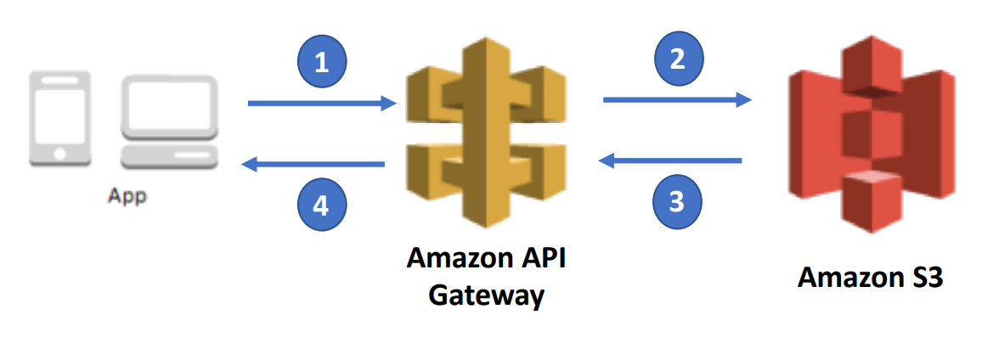
Figure 26: Client polling for updates on transaction recently made

For example, if a large data warehouse query takes an average of 2 minutes for a response, the client should poll the API after 2 minutes with exponential backoff if the data is not available. There are 2 common patterns to ensure that clients aren’t polling more frequently than expected: Throttling and Timestamp for when is safe to poll again.

For Throttling, with API Gateway you can issue API Keys with Usage Plans. Usage plans limit the consumer access to an API on a specified interval.

For timestamps, the system being polled can return an extra field with a timestamp or time period as to when it is safe for the consumer to poll once again. This approach follows an optimistic scenario where the consumer will respect and use this wisely and in the event of abuse you can also employ Throttling for a more complete implementation.

#### Review
See the [AWS Well-Architected Framework](https://aws.amazon.com/jp/architecture/well-architected/) whitepaper for best practices in the **review** area for performance efficiency that apply to serverless applications.

#### Monitoring
See the [AWS Well-Architected Framework](https://aws.amazon.com/jp/architecture/well-architected/) whitepaper for best practices in the **monitoring** area for performance efficiency that apply to serverless applications.

#### Tradeoffs
See the [AWS Well-Architected Framework](https://aws.amazon.com/jp/architecture/well-architected/) whitepaper for best practices in the **tradeoffs** area for performance efficiency that apply to serverless applications.

#### Key AWS Services
Key AWS Services for performance efficiency are DynamoDB Accelerator, API Gateway, Step Functions, NAT gateway, Amazon VPC, and Lambda.

#### Resources
Refer to the following resources to learn more about our best practices for security.

##### Documentation & Blogs

- [AWS Lambda FAQs](https://aws.amazon.com/lambda/faqs/)
- [Best Practices for Working with AWS Lambda Functions](http://docs.aws.amazon.com/lambda/latest/dg/best-practices.html)
- [AWS Lambda: How It Works](http://docs.aws.amazon.com/lambda/latest/dg/lambda-introduction.html)
- [Understanding Container Reuse in AWS Lambda](https://aws.amazon.com/blogs/compute/container-reuse-in-lambda/)
- [Configuring a Lambda Function to Access Resources in an Amazon VPC](http://docs.aws.amazon.com/lambda/latest/dg/vpc.html)
- [Enable API Caching to Enhance Responsiveness](http://docs.aws.amazon.com/apigateway/latest/developerguide/api-gateway-caching.html)
- [DynamoDB: Global Secondary Indexes](http://docs.aws.amazon.com/amazondynamodb/latest/developerguide/GSI.html)
- [Amazon DynamoDB Accelerator (DAX)](https://aws.amazon.com/dynamodb/dax/)
- [Developer Guide: Kinesis Streams](http://docs.aws.amazon.com/streams/latest/dev/amazon-kinesis-streams.html)

### Cost Optimization Pillar
The **cost optimization** pillar includes the continual process of refinement and improvement of a system over its entire lifecycle. From the initial design of your very first proof of concept to the ongoing operation of production workloads, adopting the practices in this document will enable you to build and operate cost-aware systems that achieve business outcomes and minimize costs, thus allowing your business to maximize its return on investment.

#### Definition
There are four best practice areas for cost optimization in the cloud:

- Cost-effective resources
- Matching supply and demand
- Expenditure awareness
- Optimizing over time

As with the other pillars, there are tradeoffs to consider. For example, do you want to optimize for speed to market or for cost? In some cases, it’s best to optimize for speed—going to market quickly, shipping new features, or simply meeting a deadline—rather than investing in upfront cost optimization. Design decisions are sometimes guided by haste as opposed to empirical data, as the temptation always exists to overcompensate “just in case” rather than spend time benchmarking for the most cost-optimal deployment. This often leads to drastically over-provisioned and under-optimized deployments. The following sections provide techniques and strategic guidance for the initial and ongoing cost optimization of your deployment.

Generally, serverless architectures tend to reduce costs due to the fact that some of the services (like AWS Lambda) don’t cost anything while they’re idle. However, following certain best practices and making tradeoffs will help you reduce the cost of these solutions even more.

#### Best Practices

> SERVCOST 1: What is your strategy for deciding the most optimal Lambda memory allocation?

##### Cost-Effective Resources
Serverless architectures are easier to manage in terms of correct resource allocation. The fact that almost no sizing is required with architecting and the ability to scale based on demand with services such as AWS Lambda reduces the number of decisions to make, such as cluster or instance sizing, storage, etc.

However, as we mentioned in the performance efficiency and operational excellence pillar sections, optimal memory allocation based on testing scenarios is needed to ensure the best cost/performance.

Also as described in the operational excellence pillar section, fine tuning memory and timeout will have a significant impact, not only on performance and operational procedures, but it also might reduce cost.

Better memory allocation of your Lambda functions will reduce the execution time, therefore the cost will be reduced. Also, CPU allocation is directly related to the amount of memory you allocate. The more memory you allocate, the more CPU will be allocated, which will impact performance.

Using the least amount of memory might seem like the perfect strategy for reducing costs, but using less memory means that each Lambda function will require more time to execute. Therefore, it can be more expensive due to the 100-ms incremental billing dimension.

##### Matching Supply and Demand
The AWS serverless architecture is designed to scale based on demand, so you don’t need to worry about overprovisioning or under provisioning.

##### Expenditure Awareness
As covered in the [AWS Well-Architected Framework](https://aws.amazon.com/jp/architecture/well-architected/), the increased flexibility and agility that the cloud enables encourages innovation and fast-paced development and deployment. It eliminates the manual processes and time associated with provisioning on-premises infrastructure, including identifying hardware specifications, negotiating price quotations, managing purchase orders, scheduling shipments, and then deploying the resources.

We recommend reading the [AWS Well-Architected Framework](https://aws.amazon.com/jp/architecture/well-architected/) whitepaper to dive deep into the topics discussed there. However, some of the questions mentioned there might not fully apply to serverless architectures. An example of this would be the need to decommission resources such as AWS Lambda since it doesn’t cost anything when idle.

For all other scenarios, such as unused APIs, Kinesis shards, or DynamoDB tables, existing questions and recommendations still apply and so there is no unique practice to serverless applications here.

As your Serverless architecture grows, the number of Lambda functions, APIs, Stages and further assets will multiply. Most of these architectures might need to be budgeted and forecasted in terms of costs and resource management.

Both AWS Lambda and API Gateway support tagging in functions and stages respectively. With this feature, you can allocate costs from your AWS bill to individual functions and APIs and obtain a granulated view of your costs per project in AWS Cost Explorer.

A good implementation is to share the same key-value tag for assets that belong to the project and create custom reports based on the tags you have created. This feature will help you not only to allocate your costs, but also to identify which resources belong to which projects.

##### Optimizing Overtime
As AWS releases new services and features, it is a best practice to review your existing architectural decisions to ensure that they continue to be the most cost effective. Once your infrastructure is running on a serverless architecture, you should reiterate in order to optimize costs in topics such as Lambda executions or logs storage.

> SERVCOST 2: What is your strategy for code logging in your Lambda functions?

AWS Lambda uses CloudWatch Logs to store the output of the executions in order to identify and troubleshoot problems on executions as well as monitoring the serverless application. These will impact the cost in the CloudWatch Logs service in two dimensions: ingestion and storage.

When deploying your functions to AWS Lambda, it is important to remove unnecessary print statements within the code as this will be ingested into CloudWatch and increase the cost per ingestion of the same. A good approach to maintain these prints when needed is the use tools or libraries and best practices such as [logging](https://docs.python.org/2/library/logging.html) and set the correct logging level whenever it’s needed through environment variables. This way, unless specifically activated, logs ingested will be INFO and not DEBUG.

In order to reduce log storage costs, it is recommended to leverage the following features:

- Use log retention periods for Amazon CloudWatch Logs groups for AWS Lambda.
- Export logs to a more cost-effective platform such as Amazon S3 or Amazon ES.

With these two approaches, you will be able to save costs in terms of log storage and, if needed, explore these logs with different tools directly on Amazon S3 (with, for example, Amazon Athena) or upload them to Amazon ES for troubleshooting.

> SERVCOST 3: Is your code architecture running unnecessary Lambda functions?

When designing the architecture, unnecessary Lambda executions can increase our overall solution cost. This can be avoided following this simple principle:

_Use Lambda functions to **transform data**, not to **transport data**._

If a Lambda function is just passing information from one layer of your stack to another without performing any modification, most likely this Lambda function can be replaced with a more cost effective solution.

Using features such as API Gateway service proxy or direct integrations between IoT and other AWS services will avoid both cost increases for these Lambda functions and operational overhead when managing these resources.

With regard to unnecessary invocations, integration of both Kinesis and DynamoDB with AWS Lambda makes it ideal to batch requests into a single invocation when latency is an acceptable tradeoff for throughput. This enables you to reduce overall concurrency, invocations, and cost.

Most serverless architectures use API Gateway as the entry point for final users. This is due to the fact that a RESTful API, agnostic of the implementation, is always a good service contract between our infrastructure and the final user. For more information, see the [Microservices scenario](#RESTful-Microservices).

These are some of the approaches that could be considered here:

Figure 27: Sending data to Amazon S3 using Kinesis Firehose

In this scenario, API Gateway will execute a Lambda function that will pass the data to Kinesis Firehose and further on to Amazon S3. Here the cost comes from all of these services.

However, a different approach could be:

Figure 28: Reducing cost of sending data to Amazon S3 by implementing AWS service proxy

With this approach, we remove the cost of using Lambda and unnecessary invocations by implementing the AWS Service Proxy Feature within API Gateway. However, this might introduce some extra complexity when dealing with other services such as Kinesis since, for example, we need to define shards for ingestion within each call.

We can also stream data directly from the client using the Kinesis Firehose SDK into an S3 bucket, thereby removing the costs associated with API Gateway and AWS Lambda and simplify our architecture altogether.

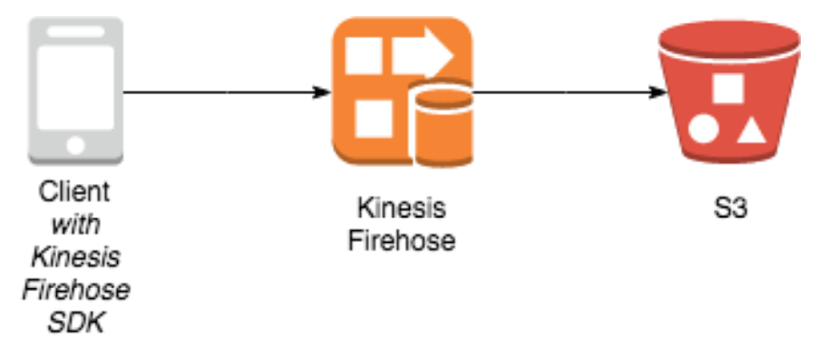
Figure 29: Reducing cost of sending data to Amazon S3 by streaming directly using the Kinesis Firehose SDK

Surely, with this implementation we won’t benefit from using the RESTful API on our application but will reduce our costs and even the latency of our streams. Depending on the specific use case, one or another of these approaches might fit your workload.

There are scenarios where you need to talk to a private endpoint/resource that may be in a VPC or on-premises. If a request does not need any transformations: such as additional headers, parameters or payload, you can use the API Gateway private integration feature instead of using a Lambda function as a proxy to private calls.

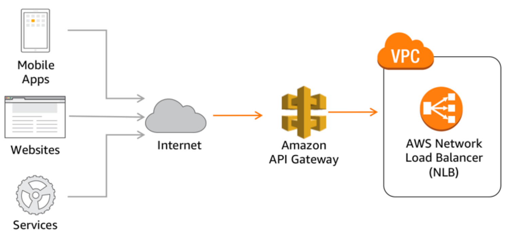
Figure 30: Amazon API Gateway Private Integrations feature over Lambda in VPC to access private resources

With this approach, API Gateway sends incoming requests to an internal network load balancer in your VPC which can forward the traffic to any backend— either in the same VPC or on-premises using an IP address. This has both cost and performance benefits as you essentially don’t need an additional hop to send requests to a private backend with the added benefits of authorization, throttling, and caching mechanisms API Gateway provides without requiring a Lambda function to proxy such request.

Amazon SNS can be used to trigger an AWS Lambda function in response to published topic messages. Since Amazon SNS publishes messages to all topic subscribers, you can optimize subscriber-relevancy and AWS Lambda usage through [SNS Filtering capabilities](https://docs.aws.amazon.com/sns/latest/dg/message-filtering.html). This enables you to apply policies to ensure subscriber notifications are sent only when the event needs to be handled. This approach avoids broadcasting all messages to all subscribers unnecessarily. This reduces the cost of your infrastructure since the logic behind this filtering is no longer within the Lambda function code.

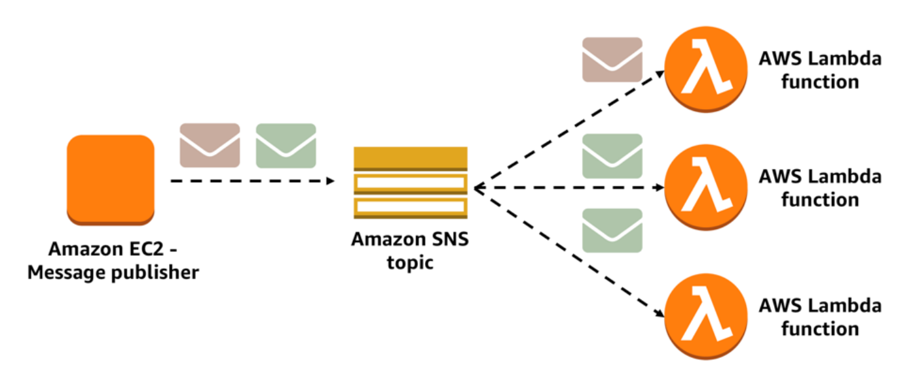
Figure 31: Amazon SNS with Message Atribute Filtering

> SERVCOST 4: How are you optimizing your Lambda functions to reduce overall execution time?

Some of the workloads our customers implement in their serverless architectures require functions to run for a long time. Within these workloads, some functions might wait for a resource to become available. This wait state can be implemented within the Lambda code waiting for some specific amount of time, however, we recommend implementing the waiting state using Step Functions instead.

With this pattern, instead of having your Lambda function waiting a specific amount of time for a resource to become available, which will incur charges and waste resources when sitting idle, you can reduce costs by implementing this wait with Step Functions. For example, in the image below, we poll an AWS Batch job and review its state every 30 s to see if it has finished. Instead of coding this wait within the Lambda function, we implement a poll (GetJobStatus) + wait (Wait30Seconds) + decider (CheckJobStatus).

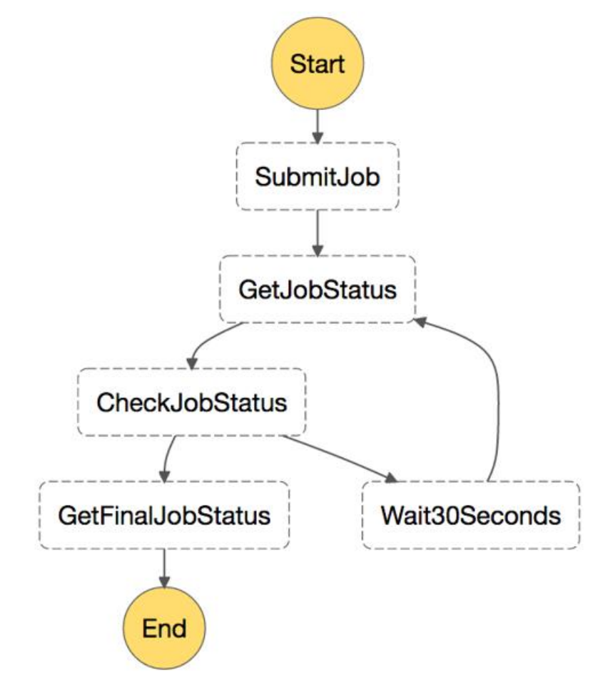
Figure 32: Implementing a wait state with AWS Step Functions

Implementing a wait state with Step Functions won’t incur any further cost as the pricing model for Step Functions is based on transitions between states and not on time within a state.

Finally, optimizing your code in order to reduce the execution time will decrease the cost per execution of your Lambda functions. The use of global variables to maintain connections to your data stores or other services/resources will increase performance and reduce execution time, which also reduce the cost. For more information, see the performance pillar section.

Additionally, when retrieving objects from Amazon S3, using other features or services could reduce both the amount of memory that the Lambda function needs and the overall execution time. Using Athena SQL queries to gather granular information needed for your execution reduces the retrieval time and object size on which perform transformations. 

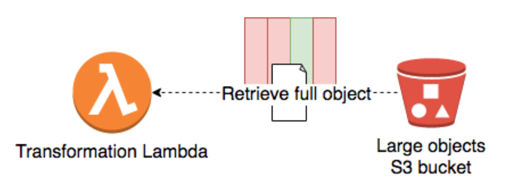
Figure 33: Lambda function retrieving full S3 object

In the above diagram, we can see that, when retrieving large objects from Amazon S3, we might increase the memory consumption of the Lambda, which increases the execution time (so the function can transform, iterate or collect required data) and, in some case, only part of this information is actually needed. This is represented with 3 columns in red (data not required) and one column in green (data required).

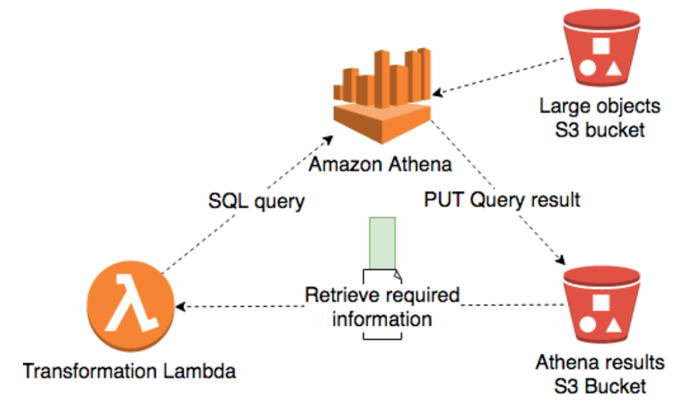
Figure 34: Lambda with Athena object retrieval

In the next diagram, we can see that, by querying Athena to get the specific data, we reduce the size of the object retrieved and, as an extra benefit, we can reuse that content since Athena saves its query results in a S3 bucket and invoke the Lambda invocation as the results land in Amazon S3 asynchronously.

A similar approach could be using with S3 Select. S3 select enables applications to retrieve only a subset of data from an object by using simple SQL expressions. As in previous example with Athena, retrieving a smaller object from Amazon S3 reduces execution time and memory utilized by the Lambda function.

Figure 35: Lambda perf stats using S3 vs S3 Select

Finally, in order to reduce both the time clients take to receive data from your API Gateway and reduce the cost on API responses, it is recommended to enable [Payload Compression](https://docs.aws.amazon.com/ja_jp/apigateway/latest/developerguide/api-gateway-gzip-compression-decompression.html) for API responses in your API Gateway.

#### Resources
Refer to the following resources to learn more about our best practices for security.

##### Documentation & Blogs

- [CloudWatch Logs Retention](http://docs.aws.amazon.com/AmazonCloudWatch/latest/logs/SettingLogRetention.html)
- [Exporting CloudWatch Logs to Amazon S3](http://docs.aws.amazon.com/AmazonCloudWatch/latest/logs/S3ExportTasksConsole.html)
- [Streaming CloudWatch Logs to Amazon ES](http://docs.aws.amazon.com/AmazonCloudWatch/latest/logs/CWL_ES_Stream.html)
- [Defining wait states in Step Functions state machines](http://docs.aws.amazon.com/step-functions/latest/dg/amazon-states-language-wait-state.html)
- [Coca-Cola Vending Pass State Machine Powered by Step Functions](https://aws.amazon.com/blogs/aws/things-go-better-with-step-functions/)
- [Building high throughput genomics batch workflows on AWS](https://aws.amazon.com/blogs/compute/building-high-throughput-genomics-batch-workflows-on-aws-workflow-layer-part-4-of-4/)
- [Simplify your Pub/Sub Messaging with Amazon SNS Message Filtering](https://aws.amazon.com/blogs/compute/simplify-pubsub-messaging-with-amazon-sns-message-filtering/)
- [S3 Select and Glacier Select](https://aws.amazon.com/blogs/aws/s3-glacier-select/)
- [Lambda Reference Architecture for MapReduce](https://github.com/awslabs/lambda-refarch-mapreduce)

##### Whitepaper
- [Optimizing Enterprise Economics with Serverless Architectures](https://d0.awsstatic.com/whitepapers/optimizing-enterprise-economics-serverless-architectures.pdf)

## Conclusion
While serverless applications take the undifferentiated heavy-lifting off developers, there are still important principles to apply.

For reliability, by regularly testing failure pathways you will be more likely to catch errors before they reach production. For performance, starting backward from customer expectation will allow you to design for optimal experience. There are a number of AWS tools to help optimize performance as well. For cost optimization, you can reduce unnecessary waste within your serverless application by sizing resources in accordance with traffic demand. For operations, your architecture should strive toward automation in responding to events. Finally, a secure application will protect your organization’s sensitive information assets and meet any compliance requirements at every layer.

The landscape of serverless applications is continuing to evolve with the ecosystem of tooling and processes growing and maturing. As this occurs, we will continue to update this paper to help you ensure that your serverless applications are well-architected.

## Contributors
The following individuals and organizations contributed to this document:

- Adam Westrich: Principal Solutions Architect, Amazon Web Services
- Mark Bunch: Enterprise Solutions Architect, Amazon Web Services
- Ignacio Garcia Alonso: Solutions Architect, Amazon Web Services
- Heitor Lessa: Sr. Specialist Solutions Architect, Amazon Web Services
- Philip Fitzsimons: Sr. Manager Well-Architected, Amazon Web Services
- Dave Walker: Sr. Specialist Solutions Architect, Amazon Web Services
- Richard Threlkeld: Sr. Product Manager Mobile, Amazon Web Services
- Julian Hambleton-Jones: Sr. Solutions Architect, Amazon Web Services

## Further Reading
For additional information, see the following:

- [AWS Well-Architected Framework](https://aws.amazon.com/jp/architecture/well-architected/)73

## Document Revisions

| Date | Description |
| --- | --- |
| November 2018 | New scenarios for Alexa and Mobile, and updates throughout to reflect new features and evolution of best practice. |
| November 2017 | Original publication. |

## Notes

1. https://aws.amazon.com/well-architected
1. http://d0.awsstatic.com/whitepapers/architecture/AWS_WellArchitected_Framework.pdf
1. https://github.com/alexcasalboni/aws-lambda-power-tuning
1. http://docs.aws.amazon.com/amazondynamodb/latest/developerguide/BestPractices.html
1. http://docs.aws.amazon.com/elasticsearch-service/latest/developerguide/esmanagedomains.html
1. https://www.elastic.co/guide/en/elasticsearch/guide/current/scale.html
1. http://docs.aws.amazon.com/streams/latest/dev/kinesis-record-processorscaling.html
1. https://d0.awsstatic.com/whitepapers/whitepaper-streaming-data-solutionson-aws-with-amazon-kinesis.pdf
1. http://docs.aws.amazon.com/kinesis/latest/APIReference/API_PutRecords.html
1. http://docs.aws.amazon.com/streams/latest/dev/kinesis-record-processorduplicates.html
1. http://docs.aws.amazon.com/lambda/latest/dg/best-practices.html#streamevents
1. http://docs.aws.amazon.com/apigateway/latest/developerguide/apigateway-api-usage-plans.html
1. http://docs.aws.amazon.com/apigateway/latest/developerguide/stagevariables.html
1. http://docs.aws.amazon.com/lambda/latest/dg/env_variables.html
1. https://github.com/awslabs/serverless-application-model
1. https://aws.amazon.com/blogs/aws/latency-distribution-graph-in-aws-xray/
1. http://docs.aws.amazon.com/lambda/latest/dg/lambda-x-ray.html
1. http://docs.aws.amazon.com/systems-manager/latest/userguide/systemsmanager-paramstore.html
1. https://aws.amazon.com/blogs/compute/continuous-deployment-forserverless-applications/
1. https://github.com/awslabs/aws-serverless-samfarm
1. https://d0.awsstatic.com/whitepapers/DevOps/practicing-continuousintegration-continuous-delivery-on-AWS.pdf
1. https://aws.amazon.com/serverless/developer-tools/
1. http://docs.aws.amazon.com/lambda/latest/dg/with-s3-example-createiam-role.html
1. http://docs.aws.amazon.com/apigateway/latest/developerguide/apigateway-method-request-validation.html
1. http://docs.aws.amazon.com/apigateway/latest/developerguide/use-customauthorizer.html
1. https://aws.amazon.com/blogs/compute/secure-api-access-with-amazoncognito-federated-identities-amazon-cognito-user-pools-and-amazon-apigateway/
1. http://docs.aws.amazon.com/lambda/latest/dg/vpc.html
1. https://aws.amazon.com/pt/articles/using-squid-proxy-instances-for-webservice-access-in-amazon-vpc-another-example-with-aws-codedeploy-andamazon-cloudwatch/
1. https://www.owasp.org/images/0/08/OWASP_SCP_Quick_Reference_Guide_v2.pdf
1. https://d0.awsstatic.com/whitepapers/Security/AWS_Security_Best_Practices.pdf
1. https://www.twistlock.com/products/serverless-security/
1. https://snyk.io/
1. https://www.owasp.org/index.php/OWASP_Dependency_Check
1. https://aws.amazon.com/answers/account-management/limit-monitor/
1. http://theburningmonk.com/2017/07/applying-the-saga-pattern-with-awslambda-and-step-functions/
1. http://docs.aws.amazon.com/lambda/latest/dg/limits.html
1. http://docs.aws.amazon.com/apigateway/latest/developerguide/limits.html#api-gateway-limits
1. http://docs.aws.amazon.com/streams/latest/dev/service-sizes-andlimits.html
1. http://docs.aws.amazon.com/amazondynamodb/latest/developerguide/Limits.html
1. http://docs.aws.amazon.com/step-functions/latest/dg/limits.html
1. https://aws.amazon.com/blogs/compute/error-handling-patterns-inamazon-api-gateway-and-aws-lambda/
1. https://aws.amazon.com/blogs/compute/serverless-testing-with-awslambda/
1. http://docs.aws.amazon.com/lambda/latest/dg/monitoring-functionslogs.html
1. http://docs.aws.amazon.com/lambda/latest/dg/versioning-aliases.html
1. http://docs.aws.amazon.com/apigateway/latest/developerguide/stages.html
1. http://docs.aws.amazon.com/general/latest/gr/api-retries.html
1. http://docs.aws.amazon.com/step-functions/latest/dg/tutorial-handlingerror-conditions.html#using-state-machine-error-conditions-step-4
1. http://docs.aws.amazon.com/xray/latest/devguide/xray-serviceslambda.html
1. http://docs.aws.amazon.com/lambda/latest/dg/dlq.html
1. https://aws.amazon.com/blogs/compute/error-handling-patterns-inamazon-api-gateway-and-aws-lambda/
1. http://docs.aws.amazon.com/step-functions/latest/dg/amazon-stateslanguage-wait-state.html
1. http://microservices.io/patterns/data/saga.html
1. http://theburningmonk.com/2017/07/applying-the-saga-pattern-with-awslambda-and-step-functions/
1. https://d0.awsstatic.com/whitepapers/microservices-on-aws.pdf
1. http://docs.aws.amazon.com/lambda/latest/dg/best-practices.html
1. https://aws.amazon.com/lambda/faqs/
1. http://docs.aws.amazon.com/lambda/latest/dg/best-practices.html
1. http://docs.aws.amazon.com/lambda/latest/dg/lambda-introduction.html
1. https://aws.amazon.com/blogs/compute/container-reuse-in-lambda/
1. http://docs.aws.amazon.com/lambda/latest/dg/vpc.html
1. http://docs.aws.amazon.com/apigateway/latest/developerguide/apigateway-caching.html
1. http://docs.aws.amazon.com/amazondynamodb/latest/developerguide/GSI.html
1. https://aws.amazon.com/dynamodb/dax/
1. http://docs.aws.amazon.com/streams/latest/dev/amazon-kinesisstreams.html
1. https://docs.python.org/2/library/logging.html
1. http://docs.aws.amazon.com/AmazonCloudWatch/latest/logs/SettingLogRetention.html
1. http://docs.aws.amazon.com/AmazonCloudWatch/latest/logs/S3ExportTasksConsole.html
1. http://docs.aws.amazon.com/AmazonCloudWatch/latest/logs/CWL_ES_Stream.html
1. http://docs.aws.amazon.com/step-functions/latest/dg/amazon-stateslanguage-wait-state.html
1. https://aws.amazon.com/blogs/aws/things-go-better-with-step-functions/
1. https://aws.amazon.com/blogs/compute/building-high-throughputgenomics-batch-workflows-on-aws-workflow-layer-part-4-of-4/
1. https://d0.awsstatic.com/whitepapers/optimizing-enterprise-economicsserverless-architectures.pdf
1. https://aws.amazon.com/well-architected